# Towards Application-level I/O Proportionality with a Weight-aware Page Cache Management
## Translate

[Abstract](#Abstract)

1. [Introduction](#Introduction)
2. [Background & Motivation](#Background)
3. [Justitia: Weight-aware Page Cache Management](#Justitia)
4. [Evaluation](#Evaluation)
5. [Related Work](#Related)
6. [Conclusion](#Conclusion)

## Abstract 

---

많은 클라우드 시스템은 I/O 리소스 제어에서 시스템의 SLO 

(서비스 수준 목표) 보장을 위해 cgroups 의 blkio 서브시스템을 사용한다.

하지만, cgroups 의 blkio 서브시스템은 원래 페이지 캐시 계층과 같은 시스템 소프트웨어 스택의 상위 계층을 고려하지 않고 block-level I/O 비례성을 달성하도록 설계되었다.

- I/O proportionality (I/O 비례성) : 요청하는 I/O 리소스의 가중치에 비례하여
    
    I/O 처리량을 관찰하는 경우 I/O 는 비례적이라고 함.
    
    즉, I/O 리소스에 입력치와 처리량의 관계가 비례적인 것
    
     **I/O 가중치에 따라 비례적으로 할당되는 어플리케이션의 대역폭 비율**
    

따라서 어플리케이션이 버퍼링된 I/O 를 활용할 때, block-level I/O 비례성이 여전히 보장되고 있더라도 어플리케이션의 성능은 I/O 비례에서 예상치 못한 결과를 나타낼 수 있다.

이 문제를 해결하기 위해 OS 가상화 기술을 사용하는 시스템에서 어플리케이션 수준 I/O proportionality 를 실현하는 **Justitia** 라는 **인식 페이지 캐시 관리 체계**를 제안한다.

Justitia 는 I/O 가중치를 기반으로 lock 대기 queue 를 재정렬하여 페이지 할당의 lock 획득 프로세스에서 가중치가 높은 응용 프로그램의 우선순위를 정한다.

또한 weight-aware page reclamation scheme 를 통해 I/O 가중치에 비례하는 각 어플리케이션에 할당된 페이지 수를 유지한다.

- weight-aware page reclamation scheme : 가중치에 따라
    
    페이지를 회수하는 scheme
    

이 실험은 Justitia 가 다양한 경우에 무시해도 될 정도의 overhead 로 I/O 비례성을 효과적으로 향상시킨다는 것을 보여준다. 

*Index terms* - 스토리지 시스템, 스케줄링 및 리소스 관리, 성능 및 서비스 품질, 가상화

> *SLO (Service Level Objectives) - 서비스 수준 목표*
> 
> 
> 기능적인 요구사항이 아닌, 응답 속도, 가용성, 처리량 등 서비스 수준을 판단할 수 있는
> 
> **정량적 척도**를 의미
> 
> SLO 가 정확히 도출되지 않으면, 서비스가 만족해야 할 성능 수준 정의가 애매.
> 
> 어떠한 지표 위주로 모니터링을 해야할 지 판단이 서지 않음.
> 
> *대역폭*
> 
> **단위 시간 동안 전달 가능한 최대 데이터 양**
> 

## 1. Introduction 

---

하드웨어 가상화, OS 가상화 등 다양한 유형의 가상화 기술을 활용하는 클라우드 서비스가 현대 컴퓨팅 환경에 만연해 있다.

이러한 클라우드 서비스에서는 고객의 요구를 충족하기 위해 서비스 수준 목표 (SLO) 를 보장하는 것이 매우 중요하다.

KVM 및 Docker 와 같은 대부분의 가상화 기술은 cgroups 을 사용하여 호스트 커널 리소스를 정확하게 관리함으로써 SLO 를 보장한다.

cgroups 은 리소스 유형별 서브 시스템 형식으로 리소스를 나타낸다.

각 서브 시스템에는 리소스 소비를 제어하는 몇 가지 매개변수가 포함되어 있다.

예를 들어, blkio (Block I/O) 서브 시스템은 block layer 에서 컨테이너의 I/O 대역폭을 구분할 수 있는 block I/O 가중치 매개변수를 제공한다.

 하지만 cgroups 은 어플리케이션 level I/O 비례가 아닌 block level 비례만을 달성하도록 설계되었으므로 캐시 계층과 같은 시스템 소프트웨어 스택의 상위 계층을 고려하지 않고 block 계층에서만 I/O 리소스를 관리한다.

따라서 어플리케이션이 페이지 캐시를 사용하는 버퍼링된 I/O 를 활용할 경우 어플리케이션 level I/O 비율이 왜곡될 수 있다.

다시 말해, 어플리케이션의 대역폭이 block 계층에서의 I/O 가중치에 비례하더라도 어플리케이션은 전체적인 관점에서 불균형 I/O 대역폭을 보여준다.

 페이지 캐시는 CPU 와 기본 스토리지 간의 성능 격차를 완화하기 위해 널리 사용되었다. 메인 메모리 공간을 활용하여 보조 저장 장치에서 송수신되는 데이터를 임시로 저장한다.

페이지 캐시는 스토리지 장치에 대한 상대적으로 느린 액세스 빈도를 줄여 I/O 성능을 크게 향상시킨다. 페이지 캐시에 의한 I/O 성능 향상으로 인해 Docker 컨테이너는 Host 페이지 캐시를 활용해 뛰어난 I/O 대역폭을 가진다.

하지만 컨테이너가 페이지 캐시의 데이터에 액세스하려고 할 때 이러한 요청은 block 계층을 통과하지 않기 때문에 cgroups 에 의해 제어되고 관리될 수 없다.

따라서 페이지 캐시는 I/O 성능의 불균형을 초래한다.

기존의 페이지 캐시 관리는 I/O 비례성 및 I/O 가중치를 고려하지 않고 페이지 할당 및 회수를 수행한다.

페이지 캐시 할당은 사용 가능한 페이지를 할당하고 페이지 캐시에 페이지를 삽입하는 것을 포함한 여러 단계로 구성된다.

페이지 할당은 여러 프로세스 간에 상호 배타적이어야 하므로 기존 페이지 캐시 관리는 페이지 할당 동기화를 위해 *qspinlock* 을 채택해 lock 대기 queue 에서 여러 lock 획득 요청을 관리한다.

그러나 *qspinlock* 은 대기열에서 가장 오래된 요소가 먼저 제공되는 FIFO queue 를 기반으로 구현된다.

FIFO queue 의 경우 I/O 가중치에 상관없이 lock 획득 순서는 대기열을 따른다.

따라서 기존의 페이지 캐시 관리는 페이지 할당에 I/O 가중치를 반영하지 않는다.

> 기존의 페이지 캐시 관리 시스템은 qspinlock 을 이용해 lock 획득 요청을 관리.
> 
> 
> qspinlock 은 FIFO queue 이므로, I/O 가중치와는 상관없이 enqueue 된 순서대로 할당해준다.
> 

 페이지 캐시에서 페이지 회수는 사용 가능한 페이지를 보호하기 위해 기존 페이지를 제거하는 프로세스를 말한다.

페이지 재확보에서 I/O 가중치를 반영하는 것이 가상화된 시스템에서 SLO 를 보장하는 데 매우 중요하지만 기존 페이지 캐시 관리는 I/O 가중치를 고려하지 않고 페이지 참조의 최신 및 빈도만 고려한다.

따라서 페이지들이 유사한 참조 특성을 가지고 있더라도, 기존의 페이지 회수는 낮은 가중치의 어플리케이션에 의해 사용되는 페이지보다 더 높은 가중치의 어플리케이션에 의해 사용되는 페이지를 회수할 수 있다.

이러한 방식으로 페이지 캐시를 사용하면 어플리케이션 level I/O 비율이 왜곡될 수 있다.

 이 문제를 해결하기 위해 가상화된 시스템에서 어플리케이션 level I/O 비례성을 실현하는 Justitia 라는 가중치 인식 페이지 캐시 관리 체계를 제안한다.

Justitia 는 페이지 할당과 회수라는 두 가지 다른 부분으로 구성되어 있다.

Justitia 는 페이지 할당 체계는 페이지 할당의 lock 획득 과정에서 더 높은 가중치의 어플리케이션을 우선시한다.

페이지 할당을 위한 lock 을 사용할 수 있을 때 Justitia 는 전체 lock 대기열을 통과해 I/O 가중치가 가장 높은 요소를 찾는다.

이후 Justitia 는 I/O 가중치가 가장 높은 요소가 다음 차례에 lock 을 보유할 수 있도록 I/O 가중치를 기준으로 lock 대기열을 재정렬한다.

이 과정을 통해 Justitia 는 각 어플리케이션의 I/O 가중치에 따라 비례적인 I/O 공유를 달성할 수 있다.

> Justitia 는 페이지 할당과 회수 부분으로 나뉘어 있는데
> 
> 
> 페이지 할당을 위해 lock 을 사용할 때, 전체 lock 대기열에서 I/O 가중치가
> 
> 가장 높은 요소를 찾는다.
> 
> 이후 Justitia 는 I/O 가중치가 가장 높은 요소가 그 다음으로 lock 을 보유할 수 있게 sorting.
> 

 Justitia 의 페이지 회수 scheme 는 페이지 회수 중에 가중치가 높은 어플리케이션이 사용하는 페이지의 우선순위를 지정한다.

Justitia 는 각 페이지의 소유권 정보를 추적하고 I/O 가중치를 기준으로 각 어플리케이션의 I/O 비율을 계산한다.

페이지 회수가 진행되는 동안 Justitia 는 필요한 페이지보다 많은 페이지를 회수하여 각 어플리케이션에 할당된 페이지 수를 I/O 가중치에 비례하도록 유지한다.

따라서 I/O 가중치가 높은 어플리케이션은 페이지 캐시에 더 많은 페이지를 가질 수 있다.

> Justitia 의 페이지 회수 체계 원리
> 
> - 가중치가 높은 어플리케이션이 사용하는 페이지의 우선순위 지정
> - 가중치를 기준으로 각 어플리케이션의 I/O 비율 계산
> - 페이지 회수 시 필요한 페이지보다 더 많은 페이지를 회수하여
>     
>     각 어플리케이션에 할당된 페이지 수를 I/O 가중치에 비례하도록 유지
>     

 I/O 가중치에 따라 lock 대기 queue 를 재정렬하면 어플리케이션이 오랫동안 lock 을 획득하지 못하는 starvation (기아) 문제가 발생할 수 있다.

높은 I/O 가중치를 가진 어플리케이션이 많을 경우 가중치가 낮은 어플리케이션은 lock 획득 기회를 계속 놓치게 되어 starvation (기아) 를 경험해야 한다.

이 문제를 해결하기 위해, 이 논문에서는 aging (노화) 이라고 불리는 전통적인 starvation (기아) 기술을 채택한다.

Justitia 는 각 재정렬 단계에서 lock 획득 차례를 생성하는 어플리케이션의 I/O 가중치를 지속적으로 증가시킨다.

따라서 낮은 가중치의 어플리케이션은 starvation (기아) 문제를 피하면서 유한한 시간 내에 lock 을 획득할 수 있다.

> 가중치가 낮은 어플리케이션은 계속해서 lock 을 획득하지 못 하는 문제 발생할 수 있다.
> 
> 
> 이를 해결하기 위해 aging  기술 사용한다.
> 
> ex) 내가 가중치가 낮아 lock 을 획득하지 못 했더라도 turn 이 한 차례 실행될 때마다
> 
> I/O 가중치가 증가됨.
> 
> turn 이 실행되다보면 내 가중치가 증가되어 있어 lock 을 획득할 수 있음.
> 

 Docker 가상화를 사용한 실험에서 어플리케이션 level I/O 비례성과 Justitia 의 성능을 측정하면서 기존 Linux 페이지 캐시 관리 성능과 비교하였다. 실제 벤치마크를 사용한 평가 결과에 따르면 Justitia 는 오버헤드가 최대 3.9% 에 불과한 기존 방식보다 최대 36.9% 향상된 I/O 비례성을 보여준다.

 이 논문의 나머지 부분은 다음과 같이 구성되어 있다.

섹션 2는 해당 work 의 배경과 동기를 자세히 설명한다.

섹션 3은 Justitia 라는 새로운 페이지 캐시 관리 체계를 자세히 설명한다.

실험 결과는 섹션 5에 제시되어 있다.

섹션 6에서는 관련 work 에 대해 논의한다.

섹션 7에서 이 논문을 마무리한다.

## 2. Background & Motivation 

---

이 절에서, Docker 컨테이너와 cgroups 에 대한 몇 가지 배경을 설명한다.

그 후, 이 작업의 배경과 함께 페이지 캐시에 대한 간략한 개요가 제공된다.

또한 동기 부여 실험 결과를 제시한다.

### A. Docker and Cgroups

Docker 는 중복된 시스템 스택 제거 및 그 결과로 인한 고성능과 같은 하이퍼바이저 기반 가상화 프레임워크에 비해 매력적인 이점으로 인해 가장 인기 있는 가상화 기술 중 하나이다.

Docker 는 OS 레벨 가상화라고 불리는 컨테이너 기술을 사용하여 가상화된 컴퓨팅 환경을 제공한다.

이 가상화 기술을 사용하면 단일 커널 인스턴스를 공유하는 여러 불리된 장치 (컨테이너) 를 하나의 물리적 Host 시스템에서 실행할 수 있다.

하지만, 이것은 컨테이너들 사이의 자원 경쟁을 유발하고, 각 컨테이너의 예상치 못한 성능 변화를 초래한다.

따라서 컨테이너의 성능 SLO 를 충족하기 위해 cgroups 을 사용해 공유 시스템 리소스를 관리하고 규제한다.

 Cgroups 은 서브 시스템의 형태로 CPU, 메모리, block I/O 와 같은 시스템 자원을 나타낸다.

각 서브 시스템에는 리소스 소비를 제어하거나 제한하는 다양한 매개변수가 있다.

이러한 서브 시스템들 중에서 blkio 서브 시스템은 block I/O 요청을 감시하고 제어하는 역할을 한다.

특히, blkio 리소스 그룹이 각 컨테이너 또는 어플리케이션에 할당되며, blkio 서브 시스템은 해당 리소스 그룹의 I/O 가중치 값을 조정하여 컨테이너/어플리케이션의 I/O 대역폭 비율을 제어한다.

 기존 시스템에서는 CFQ (Completely Fair Queuing) I/O 스케줄러가 이 I/O 가중치 (blkio) 를 사용한다. block 계층의 요청 대기열에서 발송된 I/O 수를 결정할 때 이를 통해 CFQ 스케줄러는 가중치가 높은 어플리케이션에 I/O 처리 시간을 늘려 I/O 가중치에 따라 block level I/O 비례성이 달성될 수 있도록 한다.

본 논문에서 I/O 비례성은 I/O 가중치에 따라 비례적으로 할당되는 어플리케이션의 대역폭 비율을 나타낸다. 

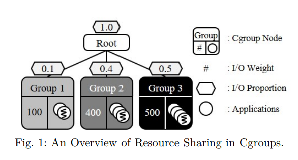

예를 들어, 그림 1에 표시된 것처럼 시스템 관리자가 I/O 가중치가 100, 400 및 500인 3개의 리소스 그룹을 생성한다고 가정하자. 그 후, 시스템에서 사용할 수 있는 총 I/O 리소스 양이 1.0인 경우 I/O 대역폭 비율이 0.1 : 0.4 : 0.5 가 되어야 한다.

 그러나 실제로는 캐시되지 않은 데이터가 요청되는 경우를 제외하고 페이지 캐시에서 block 계층을 중요 경로에서 제외할 수 있으므로 버퍼링된 I/O 로 어플리케이션 level I/O 비례성을 보장할 수 없다.

예들 들어, 어플리케이션이 페이지 캐시에 이미 저장된 데이터에 액세스하려고 할 때, 어플리케이션은 페이지 캐시 아래의 계층을 건너뛰고 페이지 캐시에서 직접 데이터를 검색한다.

페이지 캐시의 이러한 특성은 기본 스토리지 장치에 대한 상대적으로 느린 액세스를 방지하고 높은 대역폭과 짧은 대기 시간을 달성할 수 있도록 지원한다.

그러나 이러한 I/O 요청은 블록 계층을 경험하지 않기 때문에 cgroups 의 I/O 가중치를 적용할 수 없다.

또한 blkio 서브 시스템은 페이지 캐시 계층을 제어하지 않으므로 페이지 캐시 자체가 필요한 I/O 비율을 달성할 수 없다.

> 조금 이해 안 되는 부분
> 

### B. The Conventional Page Cache Management

페이지 캐시는 user space 와 block 계층 사이에서 캐싱 계층으로 작동하며 쓰기 작업을 위한 버퍼링과 읽기 작업을 위한 캐싱을 지원한다. 해당 데이터가 저장 장치에 있을 때 I/O 요청을 직접 처리함으로써 스토리지 장치에 대한 상대적으로 느린 액세스 빈도를 줄인다.

페이지 캐시 관리는 페이지 캐시 할당과 페이지 캐시 회수라는 두 가지 작업으로 구성된다.

**1) 페이지 캐시 할당**

페이지 캐시 할당은 새로 접근한 데이터에 대해 clean page 를 할당하고 페이지 캐시에 페이지를 삽입하는 것이다. 페이지 캐시는 여러 CPU 간에 공유되므로 페이지 캐시 할당은 상호 배타적이야 한다.

동기화를 위해 커널은 *qspinlock* 이라고 불리는 lock 메커니즘으로 커널을 보호한다.

*qspinlock* 메커니즘의 개요는 그림 2에 나타나 있다. 

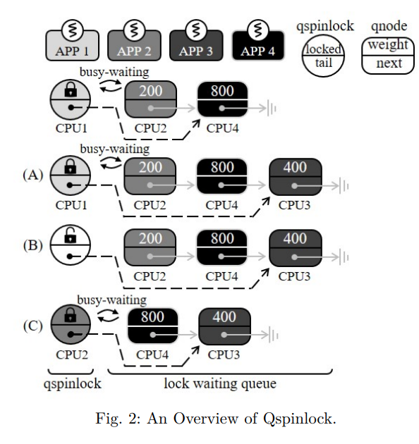

그림 2에 설명된 것처럼 *qspinlock* 메커니즘은 하나의 *qspinlock* 구조체와 CPU 당 여러 개의 qnode 로 구성되며, 각각은 lock 대기 queue 의 인스턴스이다.

locking 메커니즘에서, 페이지 할당을 위해 기존의 페이지 캐시 관리는 FIFO 방식으로 lock 대기 queue 에서 다음 lock 홀더를 선택한다.

따라서 기존의 페이지 캐시 할당은 I/O 가중치가 높은 어플리케이션의 우선순위를 지정할 수 없다.

예를 들어 그림 2에서 CPU3 이 *qspinlock* 을 획득하려고 할 때 I/O 가중치와 관계없이 lock 대기 queue 의 꼬리 부분에 대기한다. 이후 CPU1 이 *qspinlock* 을 해제하면 CPU2 는 I/O 가중치를 고려하지 않고 FIFO 방식으로 *qspinlock* 을 획득한다.

따라서 CPU3 과 CPU4 보다 먼저 *qspinlock* 을 획득한다.

마찬가지로, 기존의 페이지 캐시 관리는 I/O 가중치를 고려하지 않는 FIFO 기반 queue 를 사용하여 페이지 할당을 처리하므로 I/O 비례성이 왜곡된다.

 페이지 할당 및 해당 lock 경합은 I/O 성능에 매우 중요하며, 시스템에서 동시에 실행되는 컨테이너 수가 증가함에 따라 성능에 점점 더 큰 영향을 미친다.

다중 컨테이너 환경에서는 동시 페이지 할당 요청 수가 많기 때문에 lock 경합이 증가한다.

따라서 컨테이너의 I/O 요청은 lock 을 획득하기 위해 상당한 시간을 기다려야 한다.

여러 Fileserver Workload 를 실행하는 동안 lockstat 를 사용하여 lock 경합 count 를 측정함으로써 이 문제를 그림 3에서 설명한다.

여기서 lock 경합은 프로세스가 다른 프로세스가 이미 보유하고 있는 lock 을 획득하려고 시도하는 경우를 나타낸다.

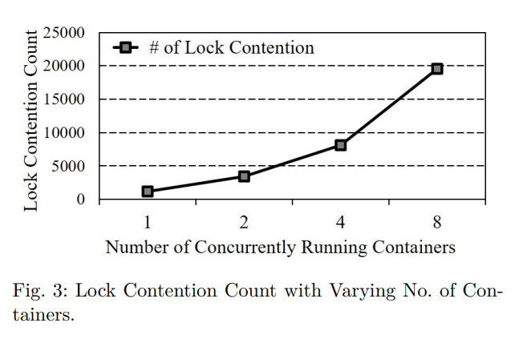

그림 3에서 볼 수 있듯이, lock 경합 횟수는 실행 중인 컨테이너 수와 함께 증가하는데, 이는 주로 여러 컨테이너의 페이지 할당 요청 경합이 높기 때문이다.

그림 3에서 컨테이너 수가 8개가 되면 lock 경쟁의 수는 약 19,500 개에 이른다.

이처럼, 시스템에서 더 많은 컨테이너가 실행될수록, lock 획득 순서는 더 중요하다.

더욱이, 이러한 문제는 사용 가능한 시스템 메모리의 양이 적고 그로인해 페이지 allocation 이 페이지 회수를 유도할 때 더욱 악화된다.

이 경우 free 페이지를 만드려면 사전에 dirty 페이지를 제거해야 하기 때문에 free 페이지를 할당하는 데 200ms 이상이 걸릴 수 있는 것으로 알려졌다.

 페이지 캐시 할당으로 인한 I/O 비례성의 왜곡을 보여주기 위해 Filebench 에서 Fileserver Workload 로 실험을 수행하였다. 우리는 서로 다른 가중치 (즉, 100, 200, 400, 800) 를 가진 네 개의 컨테이너에서 이 워크로드를 실행했다. 실험은 **(1) I/O 요청이 페이지 캐시 계층을 우회하는 Direct I/O**와 **(2) I/O 요청이 페이지 캐시를 버퍼링 및 캐싱에 사용하는 버퍼링 I/O** 의 두 가지 I/O 유형으로 수행된다.

파일 수가 30,000개로 설정된 것을 제외하고 우리는 기본 파일 서버 설정을 사용했다.

실험 설정은 섹션 4의 표 1에 설명되어 있다.

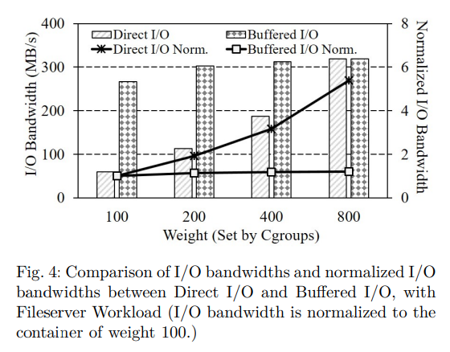

그림 4는 두 가지 다른 I/O 유형에 대한 I/O 대역폭과 정규화된 (가중치 100의 컨테이너 대역폭에 대한) I/O 대역폭을 보여준다. I/O 비례성을 계산할 때 각 컨테이너의 대역폭에 대한 상대 비율만 필요하므로, 이 논문에서 I/O 비례성에 대한 모든 결과가 정규화된다는 점에 유의하자.

그림 4와 같이 Direct I/O 는 적절한 I/O 비례 (1 : 1.9 : 3.2 : 5.4) 를 나타낸다.

반면에 버퍼링된 I/O 는 서로 다른 가중치의 컨테이너에서 유사한 성능을 보인다는 점에서 비례성이 떨어진다.

버퍼링된 I/O 의 만족스럽지 못한 결과는 페이지 캐시에서 I/O 작업의 버퍼링으로 인해 발생한다.

 파일 서버는 쓰기 집약적인 I/O 워크로드이므로 버퍼링된 I/O 의 경우 대부분의 I/O 작업이 페이지 캐시에 흡수된다.

그러나 기존의 페이지 캐시 관리는 쓰기 성능과 관련된 페이지 할당 단계에서 더 높은 가중치의 어플리케이션을 우선시하지 않는다.

오히려 페이지 할당 프로세스 동안 FIFO 방식으로 어플리케이션을 처리한다.

따라서 컨테이너의 I/O 가중치가 다르더라도 버퍼링된 I/O 는 I/O 대역폭을 구분할 수 없다.

 그럼에도 불구하고 Direct I/O 와 버퍼링된 I/O 두 경우 간의 총 대역폭 차이는 페이지 캐시를 사용해야 하는 분명한 이유를 보여준다.

그림 4의 실험에서 Direct I/O 가 있는 컨테이너 4개의 총 대역폭은 677.3 MB/s 이고 

버퍼링된 I/O 가 있는 컨테이너의 총 대역폭은 1200.4 MB/s 이다.

페이지 캐시의 엄청난 I/O 성능 향상을 고려할 때, SLO 가 매우 중요한 클라우드 시스템에서도

페이지 캐시를 무시할 수 없다.

**2) 페이지 캐시 회수**

페이지 회수는 기존 페이지를 제거하여 페이지 캐시에서 사용 가능한 페이지를 안전하게 보호하기 위해 수행된다.

기존의 페이지 캐시 관리는 자주 액세스 하는 페이지를 유지하기 위한 활성 목록과

다른 페이지에 대한 비활성 목록인 두 개의 LRU 목록을 관리한다.

페이지에 처음 접근할 때 비활성 목록의 맨 위에 배치된다.

그런 다음 페이지에 다시 액세스할 때 활성 목록으로 승격할 수 있다.

활성 목록의 페이지는 다시 액세스할 수 없는 것으로 간주될 때 비활성 목록으로 강등된다.

마지막으로 사용 가능한 메모리 공간이 미리 정의된 임계값보다 낮아지면

비활성 목록의 맨 끝에 있는 페이지가 회수된다.

그러나 이 과정에서 LRU 정책은 어플리케이션의 I/O 가중치를 고려하지 않고

참조 카운트와 페이지 참조의 최신성만 고려한다.

따라서 가중치가 높은 어플리케이션이 사용하는 페이지는 가중치가 낮은 어플리케이션이 사용하는 페이지보다 먼저 삭제될 수 있다.

이러한 현상은 읽기 요청이 기본 스토리지에 액세스 해야 하므로 가중치가 높은 어플리케이션의 읽기 성능을 저하시킨다.

결과적으로 기존의 페이지 캐시 회수는 불균형적인 I/O 공유를 초래한다.

 페이지 캐시 회수로 인한 I/O 비례성 왜곡을 보여주기 위해 FIO 의 Re-read 워크로드로 실험을 수행하였다. 그림 4의 이전 동기 실험처럼, 우리는 서로 다른 가중치 (즉, 100, 200, 400, 800) 를 가진 네 개의 컨테이너에 이 작업량을 실행했다. 각 컨테이너는 3GB 테스트 파일을 하나씩 생성하여 파일의 모든 페이지를 페이지 캐시로 캐싱한다. 그런 다음 호스트는 4GB 더미 파일을 작성하여 과도한 페이지 회수를 트리거한다. 마지막으로 각 컨테이너에서 1GB Re-read 작업을 실행하고 그림 5와 같이 I/O 대역폭을 측정하였다.

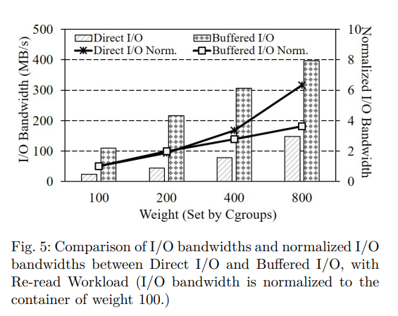

 실험은 Direct I/O 와 버퍼링된 I/O 의 두 가지 다른 유형의 I/O 로도 수행된다. 그림 5와 같이 버퍼링된 I/O 는 Direct I/O 에 비해 I/O 비례성이 떨어진다. 많은 수의 재읽기 요청이 버퍼링된 I/O 의 경우 페이지 캐시에서 처리된다. 불행히도 기존의 페이지 캐시 관리가 호스트에서 dummy write 후 페이지를 제거할 때 페이지 회수동안 I/O 가중치를 고려하지 않는다. 따라서 일부 페이지는 가중치가 높은 컨테이너에서 사용하더라도 가중치가 낮은 컨테이너에서 사용하는 페이지보다 먼저 제거되므로 I/O 비례성이 저하된다.

 앞에서 언급한 기존 페이지 캐시 관리에 대한 분석을 통해 I/O 가중치를 고려하지 않고 FIFO 및 LRU 정책을 엄격하게 유지하는 것은, 가중치 적용 어플리케이션을 실행할 때 I/O 비례성에 좋지 못하다는 결론을 내린다. 위의 동기 분석을 바탕으로 앞서 언급한 문제를 적절하게 해결하는 새로운 페이지 캐시 관리 방식을 제안한다. 이 논문에서는 읽기/쓰기 작업이 페이지 캐시 아래의 계층으로 전달되지 않더라도 읽기/쓰기 작업을 I/O 로 간주한다.

## 3. Justitia: Weight-aware Page Cache Management 

---

이전 섹션에서 논의한 바와 같이 기존의 페이지 캐시 관리는 FIFO qspinlock 을 사용하여 페이지 캐시 할당에 대한 동기화를 처리하고 각 어플리케이션의 I/O 가중치가 전혀 반영되지 않는 LRU 정책에 따라 페이지 캐시의 페이지를 관리한다.

이 섹션에서는 어플리케이션 level I/O 비례성을 실현하는 Justitia 라는 가중치 인식 페이지 캐시 관리 체계를 제안한다.

Justitia 는 두 가지 주요 정책으로 구성된다.

**(1) Justitia 는 페이지 할당 단계에서 더 높은 가중치의 어플리케이션에 우선순위를 부여**하고,

(2) **페이지 회수 단계에서 I/O 가중치에 따라 페이지 캐시에 있는 각 어플리케이션의 페이지 수를**

**균형있게 조정**하려고 한다.

**A. Weight-aware Qspinlock for Page Cache Allocation**

(페이지 캐시 할당을 위한 가중치 인식 Qspinlock)

페이지 캐시에 대한 페이지 할당 중에 기존의 qspinlock 은 진입 (FIFO) 순서대로 경쟁 어플리케이션을 enqueueing 하여 동기화를 관리한다.

그러나 이 qspinlock 메커니즘은 FIFO 정책이 어플리케이션의 차별화된 대역폭 요구사항 (즉, I/O 가중치) 을 무시하기 때문에 I/O 비례성을 왜곡한다.

페이지 할당 중 I/O 비례성을 높이기 위한 우리의 솔루션은 I/O 가중치를 기준으로 lock 대기 queue 를 재정렬하는 것이다.

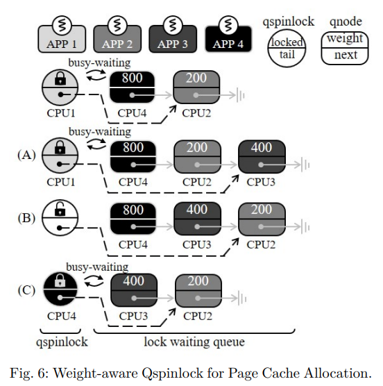

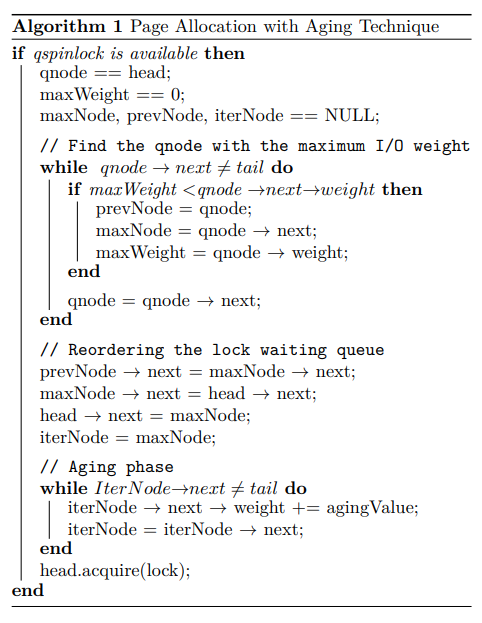

가중치 인식 qspinlock 의 개요는 그림 6에 나와 있으며, 자세한 pseudo code 는 알고리즘 1에 나와있다.

첫째, 어플리케이션이 페이지 캐시를 위해 새로운 페이지를 요청할 때, Justitia 는 대기 queue 의 끝에 어플리케이션을 위한 qnode 구조체를 생성하고 I/O 가중치를 qnode 구조체에 저장한다(A). 현재 qspinlock 홀더가 잠금을 해제하면 대기 queue 의 head node 는 qspinlock 에 대한 busy-waiting 을 중지하고 대기 queue 를 통과하여 head node 를 따르는 qnode 중에서 가장 높은 가중치의 노드 (maxNode) 를 찾는다.

그런 다음 head node 는 다음 포인터를 maxNode 의 주소로 조작하고 재순서의 영향을 받는 다른 qnode 의 다음 포인터를 조정하여 head node 바로 다음에 maxNode 를 이동한다.

결국, head node 가 qspinlock 을 보유하게 되면, maxNode 는 queue 의 새로운 head 가 되며,

lock 홀더가 qspinlock 을 해제하면 qspinlock 을 우선적으로 획득하게 된다(C).

따라서 가중치가 높은 어플리케이션은 가중치가 낮은 어플리케이션보다 상대적으로 빠르게 페이지를 얻는다.

그림 6의 예에서 CPU1 이 qspinlock 을 해제하면 CPU4 는 busy-waiting 를 중지하고 head node (CPU4) 를 따르는 qnode 중에서 가장 높은 가중치를 갖는 노드를 찾는다.

그런 다음 CPU4 는 CPU3 을 다음 노드로 이동시키고, 이동과 관련된 다른 qnode 의 다음 포인터를 조작한다.

그림 6의 경우 CPU3 이 꼬리에 있기 때문에 Justitia 는 기존 꼬리 (CPU3) 의 이전 qnode (CPU2) 를 가리키도록 현재 lock 홀더의 꼬리 (CPU1) 를 추가로 변경한다.

CPU3 과 CPU2 의 다음 포인터는 각각 CPU2 의 qnode 와 NULL 을 가리키도록 수정되었다.

결과적으로 현재 head node 가 qspinlock 을 획득하면 CPU3 의 qnod 가 queue 의 head 가 되고 다음 단계에서 우선적으로 lock 을 획득한다.

 하지만 Justitia 는 낮은 가중치의 어플리케이션이 반복적으로 lock 획득의 차례를 양보해야 한다는 점에서 어플리케이션이 매우 오랫동안 lock 획득을 거부당하는 starvation (기아) 문제를 야기할 수 있다.

가중치가 높은 어플리케이션이 많은 경우, 가중치가 낮은 어플리케이션은 maxNode 가 될 가능성이 낮기 때문에 lock 을 획득할 기회가 없을 수 있다.

이러한 기아 문제가 장기적인 불공정성과 시스템 장애까지 초래할 수 있기 때문에 튼튼한 시스템을 구축하려면 반드시 사전에 예방해야 한다.

 이를 방지하기 위해, 우리는 queue 에 있는 대기 시간을 기반으로 시간이 지남에 따라 작업의 우선순위를 점차 높이는 aging (노화) 라고 하는 기존의 잘 알려진 기아 기술을 채택한다.

Justitia 는 lock 획득이 발생할 때마다 선택되지 않은 qnode (그림 6의 경우 CPU2 의 qnode) 의 가중치를 특정 값만큼 증가시킨다.

이를 통해 Justitia 는 페이지 할당을 위한 다음 lock 홀더를 결정할 때  I/O 가중치뿐만 아니라 대기 시간도 고려할 수 있다.

 알고리즘 1은 Justitia 의 pseudo-code 를 노화 기술로 제시한다.

최대 I/O 가중치 (maxNode) 의 qnode 를 찾은 후 Justitia 는 maxNode 를 현재 head node 옆으로 이동하여 다음 차례에 maxNode 가 qspinlock 을 취할 수 있도록 한다.

이후 기아 문제를 방지하기 위해 Justitia 는 maxNode 이후 모든 qnode 의 I/O 가중치를 증가시켜 재정렬 단계에서 차례를 산출했다.

cgroups 에서 수동으로 설정할 수 있는 최대 I/O 가중치는 1000이다.

반면에 조정된 I/O 가중치는 최대 I/O 가중치 (1000) 보다 높을 수 있다.

따라서 I/O 가중치와 관계없이, 어떤 어플리케이션도 결국 aging 기술로 인해 maxNode 가 되어 lock 을 획득할 수 있다.

결과적으로 어플리케이션이 결국 모든 경우에 페이지 할당을 위한 qspinlock 을 보유할 수 있으므로 기아 문제를 방지할 수 있다.

섹션 4의 실험에서 컨테이너의 가중치 척도를 고려하여 증분 값을 100으로 설정하였다.

> 1000 이상으로 가중치를 적용하면 어떻게 되는가 ?
> 

### B. Weight-aware Page Reclamation

(가중치 인식 페이지 회수)

기존의 페이지 캐시는 2개의 LRU 목록으로 구성되어 참조 횟수와 참조 최신성을 고려하여 hit 비율을 효과적으로 향상시킨다.

하지만 페이지 할당 프로세스와 마찬가지로 이 메커니즘은 cgroups 의 I/O 가중치를 반영하지 않으므로 I/O 비례성을 저하시킨다.

이 문제를 해결하기 위해 Justitia 는 페이지가 필요한 것보다 많은 페이지가 있는 어플리케이션의 페이지를 회수하여 각 어플리케이션에 할당된 페이지 수를 I/O 가중치에 비례하도록 유지하려고 한다.

이를 위해 Justitia 의 페이지 회수는 다음 작업을 수행한다.

1) 어플리케이션별 I/O 비율 계산

2) 페이지 구조에 대한 페이지 소유권 정보 기록

3) I/O 비율을 고려한 페이지 회수

**1) 어플리케이션별 I/O 비율 계산**

먼저 Justitia 는 해당 I/O 가중치를 사용하여 각 어플리케이션의 I/O 비율을 계산하고 이 값을 비율 변수에 저장한다.

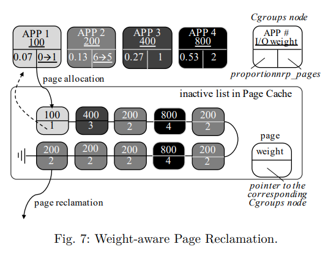

예를 들어 그림 7에서 시스템은 I/O 가중치가 각각 100, 200, 400, 800 인 4개의 cgroup 노드에서 4개의 어플리케이션을 실행한다.

그러면 시스템에서 사용할 수 있는 페이지 캐시 자원의 총량이 1.0 일 때 각 어플리케이션의 비율은 각각 0.07, 0.13, 0.27, 0.53 이다.

Justitia 는 nrp 페이지 변수에서 각 어플리케이션에 할당된 페이지 수를 추적한다.

Justitia 는 각 어플리케이션의 해당 cgroups 노드에서 비율 및 nrp 페이지 변수를 관리한다.

**2) 페이지 구조에 대한 페이지 소유권 정보 기록**

어플리케이션이 페이지 캐시에 새 페이지를 할당할 때 Justitia 는 어플리케이션의 I/O 가중치를 페이지 구조체에 저장한다.

이후 Justitia 는 페이지 소유권을 명확히 하고 페이지 회수 중에 cgroups 노드의 변수 (비율 및 nrp 페이지) 를 참조하기 위해 페이지를 해당 cgroups 노드에 연결한다.

마지막으로 cgroups 노드의 nrp 페이지 변수를 증가시켜 각 어플리케이션이 소유한 페이지 수를 추적한다.

예를 들어 그림 7에서 새 페이지가 APP1 에 할당되므로 nrp 페이지 변수가 0에서 1로 증가하며 해당 cgroups 노드는 새로 할당된 페이지 구조체에 연결된다.

여러 어플리케이션이 동일한 페이지를 공유할 때 Justitia 는 가장 가중치가 높은 어플리케이션을 페이지 소유자로 지정한다.

**3) I/O 비율을 고려한 페이지 회수**

페이지 회수 중에 Justitia 는 각 어플리케이션에 할당된 페이지 수를 I/O 가중치에 비례하도록 유지한다.

이를 위해 Justitia 는 다음 절차를 수행한다.

커널 회수 쓰레드로 페이지를 회수해야 할 경우 Justitia 는 비활성 목록의 끝에서 회수할 페이지를 검색한다.

이 과정에서 Justitia 는 I/O 가중치와 비례성을 고려하여 어플리케이션의 임계값을 계산하며, 각 값은 어플리케이션이 가져야 할 최대 페이지 수를 나타낸다.

임계값은 다음 방정식으로 계산할 수 있다.

*임계값 = NR_FILE_PAGES x 비율* 

1) 여기서 NR_FILE_PAGES 는 커널이 추적하는 파일 백업 페이지 캐시 항목의 수이다.

페이지 캐시 항목의 총 수에 이 값을 사용한다.

어플리케이션이 페이지 캐시에 있는 임계값보다 많은 페이지를 가지고 있는 경우, Justitia 는 해당 페이지를 회수한다.

이를 통해 Justitia 는 각 어플리케이션의 페이지 수를 I/O 무게 대비 유지하여 I/O 비례성을 높일 수 있다.

 예를 들어, 그림 7과 같이 4개의 어플리케이션이 각각 1, 6, 1, 2 페이지라고 가정한다.

총 페이지 캐시 항목 수가 10이므로 NR_FILE_PAGES 는 10을 보유한다.

페이지 회수가 발생하면 Justitia 는 어플리케이션의 페이지가 임계값보다 많은 페이지를 찾는다.

이 예에서 APP2 는 현재 6페이지가 있으며 임계값 1.3 (10 * 0.13) 을 초과한다.

따라서 Justitia 는 APP2 페이지를 회수하고 cgroups 노드의 nrp 페이지를 6개에서 5개로 줄인다.

Justitia 는 이 과정을 반복적으로 수행함으로써 I/O 가중치에 비례하는 어플리케이션별 페이지 수를 유지할 수 있다.

 페이지 회수는 페이지 캐시의 내용을 결정한다는 점에서 버퍼링된 읽기 성능과 밀접한 관련이 있다.

버퍼링된 읽기 작업은 페이지 캐시에서 해당 데이터의 존재 여부에 따라 페이지 캐시 계층에서 서비스될 수 있다.

Justitia 는 페이지 캐시에 가중치가 더 높은 어플리케이션의 더 많은 데이터를 유지하려고 하며, 이는 차례로 기본 저장소에 액세스하지 않고 페이지 캐시에서 읽기 요청을 처리할 확률을 높인다.

결과적으로  Justitia 는 가중치가 높은 어플리케이션의 우선 순위를 지정하여 I/O 비례를 향상시킬 수 있다.

 페이지 회수 중 I/O 가중치가 반영되어 Justitia 의 캐시 hit 비율의 감소를 우려할 수 있다.

그러나 Justitia 는 일반적인 페이지 회수 이점을 유지하기 위해 전반적인 회수 정책에 대해 여전히 2QLRU 를 유지한다.

또한 Justitia 는 자주 액세스하는 데이터 그룹이면서 높은 캐시 적중률에 크게 기여하는 활성 목록에 I/O 가중치 인식을 적용하지 않는다.

우리의 방식에서는 페이지 캐시의 높은 적중률을 기존과 같이 유지하기 위해 LRU 를 사용하여 활성 목록에서 비활성 목록으로 이동한다.

또한 Justitia 는 동일한 croups 에서 사용하는 페이지에 대해 LRU 정책을 적용한다.

마지막으로 Justitia 는 OOM (Out-Of-Memory) 문제를 방지하기 위해 시스템에 여유 페이지가 부족한 직접 회수의 경우 기존 페이지 회수를 수행한다.

> 2QLRU :  active queue 와 inactive queue, 두 개의 Q를 가진 LRU ... ??
> 
> 
> OOM 이 뭔지 알아보기
> 

## 4. Evaluation 

---

### A. Evaluation Setup and Test Settings

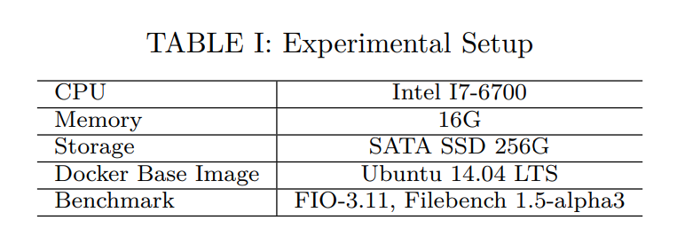

Justitia 를 구현하기 위해 리눅스 커널 버전 4.19.16 의 페이지 할당 및 페이지 캐시 관리를 위한 lock 메커니즘을 수행했다.

Justitia 를 종합적으로 평가하기 위해 표1에서 설명된 대로 Docker v18.09.4-CE 를 사용하는 가상화 환경에서 real 벤치마크와 synthetic 벤치마크를 모두 실행했다.

> synthetic 벤치마크란 ?
> 

 먼저, 서로 다른 가중치가 적용된 8개의 컨테이너에서 8개의 파일 서버 워크로드를 실행하여 어플리케이션 수준 I/O 비례 측면에서 Justitia 의 페이지 할당에서 가중치를 인식하는 qspinlock 을 조사했다.

파일 서버 작업량은 쓰기 집약적이므로 페이지 할당이 자주 발생한다.

둘째, Justitia 의 페이지 회수를 평가하기 위해 FIO (Flexible I/O Tester) 벤치마크를 사용하여  Re-read 실험을 수행했다.

Re-read 실험에서 서로 다른 I/O 가중치를 가진 4개의 컨테이너는 자체 파일을 작성하고 dummy 쓰기로 페이지 캐시를 오염시킨 후 파일을 다시 읽어 각 컨테이너의 페이지 수가 페이지 캐시에 얼마나 있는지 검사한다.

셋째, Justitia 의 추가 절차로 인한 오버헤드를 조사하기 위해 동일한 I/O 가중치를 가진 4개의 컨테이너에서 쓰기 및 읽기 집약적인 워크로드를 모두 실행하고 총 대역폭과 평균 대기 시간을 측정했다.

넷째, 기존 메모리 cgroups 이 우리 계획의 대안이 아님을 확인하기 위해, 파일 서버와 재읽기 실험을 모두 수행하여 우리의 체계를 cgroups 과 비교한다.

마지막으로, aging 기술의 효과를 확인하기 위해 가장 낮은 가중치가 있는 컨테이너와 가장 높은 가중치가 있는 여러 컨테이너가 함께 실행되는 극한 시나리오로 실험을 수행했다.

 모든 실험은 그림에서 *Conventional* 이라고 하는 기존의 Linux 페이지 캐시 관리로 수행된다.

I/O 비례성을 정량적으로 측정하기 위해, 우리는 다음과 같이 소개된 비례 변동 (PV) 이라는 새로운 지표를 채택한다.

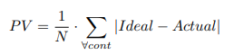

> proportionality variation (PV) : 비례 변동
> 

여기서 cont 는 컨테이너, N 은 컨테이너 수, Ideal 은 이상적인 I/O 비례율, Actual 은 실험에서 얻은 실제 I/O 비례성이다.

값이 낮을수록 실제 비례성이 이상적인 비례성과 가깝다.

### B. Page Allocation

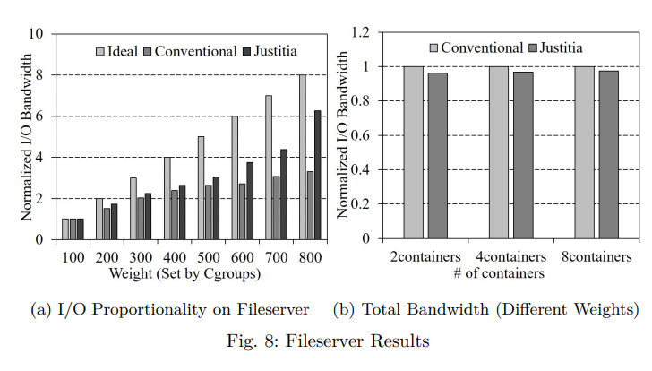

그림 8a 는 쓰기 집약적인 파일 서버 워크로드에서 8개 컨테이너의 표준화된 I/O 비례성을 보여준다.

그림 8a 의 x 축과 같이 컨테이너에 100부터 800까지 다양한 가중치를 설정하였다.

컨테이너의 대역폭은 가중치가 100인 컨테이너의 대역폭으로 표준화된다.

Ideal 은 컨테이너가 달성할 것으로 예상되는 이상적인 I/O 비례성을 나타낸다.

가중치 100에서 800까지 Justitia 의 I/O 비례는 1 : 1.73 : 2.24 : 2.65 : 3.04 : 4.37 : 6.26인 반면,

기존 방식은 1 : 1.51 : 2.02 : 2.40 : 2.63 : 2.07 : 3.01이다.

특히 가중치가 800인 경우 Justitia 는 이상적인 경우보다 1.74 만 낮은 반면, 기존의 방식은 이상적인 경우보다 4.96 더 낮다.

Justitia 는 페이지 할당 시 lock 획득 프로세스에서 가중치가 높은 컨테이너를 우선하기 때문에 기존보다 우수한 I/O 비례성을 달성할 수 있다.

그 결과, 가중치가 높은 컨테이너는 쓰기 작업을 빠르게 완료할 수 있으므로 I/O 대역폭이 더 높다.

비율 변동 (PV) 측면에서 Justitia 는 기존 방식보다 약 36.9% 더 우수하다.

또한 Justitia 의 페이지 할당 체계의 오버헤드를 분석하기 위해 컨테이너 수를 2개에서 8개로 변경하면서 총 I/O 대역폭을 측정했다.

이전 실험과 마찬가지로 서로 다른 가중치를 가진 컨테이너로 파일 서버 벤치마크를 실행했다.

그림 8b 와 같이 Justitia 를 적용했을 때 총 입출력 대역폭이 최대 3.9% 감소하는 데 그친다는 실험 결과가 나왔다.

### C. Page Reclamation

Justitia 의 가중치 인식 페이지 회수를 평가하기 위해 [섹션 2.B.2](https://www.notion.so/Towards-Application-level-I-O-Proportionality-with-a-Weight-aware-Page-Cache-Management-b93cc7311b5f48beaf1dd2fa779a1a81) 에 제시된 동기 실험과 동일한 재읽기 실험을 수행했다.

우리는 가중치 I/O 중량이 각각 100, 200, 400, 800 인 컨테이너 4개를 실행했다.

우리의 실험 결과에서 모든 성능 값은 가장 낮은 가중치의 결과로 정규화된다.

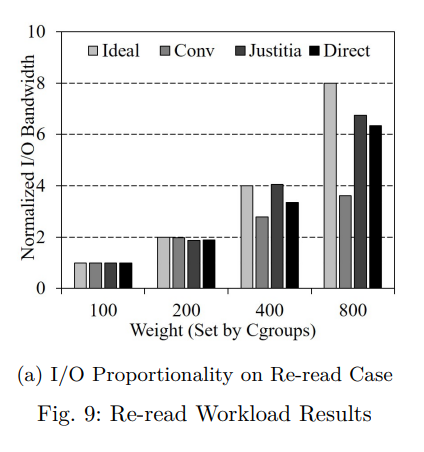

그림 9a 에서 볼 수 있듯이, 기존의 페이지 회수 방식은 I/O 가중치를 고려하지 않기 때문에 I/O 비례성이 낮다.

따라서 기준 카운트가 동일한 경우에도 가중치가 높은 컨테이너의 페이지는 가중치가 낮은 컨테이너의 페이지보다 먼저 제거될 수 있다.

 그 결과, 기존 방식은 1.4 의 비례 변동 (PV) 을 보인다.

반면에 Justitia 는 페이지 캐시에서 더 높은 가중치의 컨테이너의 페이지를 더 길게 유지함으로써 I/O 가중치에 따라 컨테이너의 할당된 페이지 수를 균형있게 조정하기 때문에 0.33 의 비례 변동 (PV) 을 보여준다.

직접 I/O 가 0.61 의 비례 변화 (PV) 를 보인다는 점에서 이 결과는 직접 I/O 의 결과보다 훨신 우수하다.

### D. Overhead of Justitia

Justitia 에 의해 유발된 오버헤드를 조사하기 위해 서로 다른 I/O 가중치를 가진 4개의 컨테이너에서 웹 서버 워크로드를 실행하는 동안 적중률을 측정했다. 또한 동일한 가중치의 컨테이너 4개에서 파일 서버 및 재읽기 워크로드를 수행하면서 총 대역폭과 평균 대기 시간을 측정했다.

그림 10a 와 같이 전체 적중률이 평균 0.8% 정도 하락하는 것을 볼 수 있는데, 이는 Justitia 가 가중치가 낮은 컨테이너의 페이지 우선순위를 낮추어도 만족할 만한 적중률을 유지하고 있음을 의미한다.

이 결과는 Justitia 가 비활성 목록에서만 I/O 가중치를 반영한다는 사실에서 비롯된다.

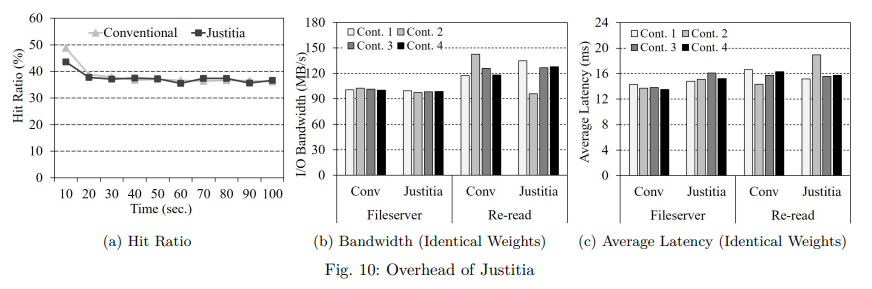

그림 10b 는 파일 서버의 쓰기 대역폭과 재읽기 워크로드의 읽기 대역폭을 보여준다.

그림 8b 및 그림 9a 와 동일한 구성으로 수행되지만 본 실험에서 모든 컨테이너가 동일한 I/O 가중치를 갖는다.

기존 방식과 비교하여 Justitia 는 파일 서버 및 재읽기 워크로드에서 총 대역폭이 각각 2.7%, 3.7% 감소했다.

또한 Justitia 에서는 파일서버 실행 지연 시간과 재읽기 작업량 실행 지연시간이 각각 평균 1.5ms, 0.6ms 씩 증가한다.

Justitia 의 이러한 오버헤드는 페이지 할당 중에 가중치가 더 높은 컨테이너를 검색하고 페이지 회수를 위해 어플리케이션당 할당된 페이지 수를 반복적으로 추적하는 데서 비롯된다.

그러나 I/O 비례성의 만족스러운 결과를 고려할 때 Justitia 는 감지할 수 없는 오버헤드로 I/O 비례성을 개선하는 데 매우 실용적이라고 생각한다.

모든 컨테이너가 동일한 I/O 가중치를 가질 때 Justitia 는 컨테이너에 자원을 균등하게 분배한다는 점에서 기존 시스템과 동일한 방식으로 작동한다.

### E. Comparison with Memory Cgroups

Justitia 의 대안으로 cgroups 의 메모리와  blkio 조합을 생각할 수 있다.

cgroups 의 메모리 서브 시스템은 각 어플리케이션의 최대 메모리 사용량을 제어하는 기능을 제공하고, 총 메모리 사용량을 계산할 때 파일 백업 페이지와 익명 페이지를 구분하는 기능을 제공한다.

> anonymous page (익명 페이지) 란 ?
> 

그러나 리소스 그룹의 메모리 사용량이 메모리 제한을 초과하면 메모리 cgroup 은 해당 파일 백업 페이지뿐만 아니라 익명 페이지도 회수한다.

따라서 I/O 성능에 영향을 미치는 파일 백업 페이지의 양을 단독으로 제한할 수는 없다.

결과적으로 I/O 비례성은 여전히 메모리 cgroup 에 의해 보장될 수 없다.

 이를 확인하기 위해 파일 서버와 재읽기 벤치마크를 모두 실행하고 메모리 cgroup 의 실험 결과를 우리 계획의 실험 결과와 비교했다.

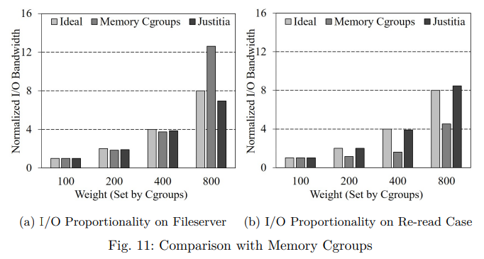

여기서 메모리 cgroup 의 경우 Justitia 의 I/O 가중치와 동일한 메모리 한계 비율 (1 : 2 : 4 : 8)을 설정한다.

그림 11a 의 파일 서버 실험에서 메모리 cgroup 은 낮은 I/O 비례성을 보여 4.25의 PV 를 보이는 반면 Justitia 의 PV 는 0.33 이다.

특히 메모리 cgroup 의 경우 I/O 가중치가 800인 컨테이너는 가장 낮은 컨테이너 (100) 보다 12.6배 높은 I/O 대역폭을 보여준다.

또한 가중치 100에서 800까지의 재읽기 워크로드 실험의 그림 11b 에 나타난 바와 같이 Justitia 의 I/O 비례성은 1 : 2.02 : 3.91 : 8.46 인 반면 메모리 cgroup 은 1 : 1.15 : 1.60 : 4.53 이다.

Justitia 와 메모리 cgroup 의 PV 는 각각 0.14 와 1.67 이다.

이 결과는 메모리 cgroup 이 익명 페이지를 제외하면서 파일 백업 페이지 (페이지 캐시) 제한을 단독으로 제어할 수 없기 때문이다.

### F. Justitia with Aging Technique

기아 문제를 방지하기 위해 가중치 인식 qspinlock 방식에 aging 기술을 추가했다.

극단적인 경우 우리의 계획이 견고함을 확인하기 위해, 우리는 8개의 컨테이너로 파일 서버 실험을 수행했다.

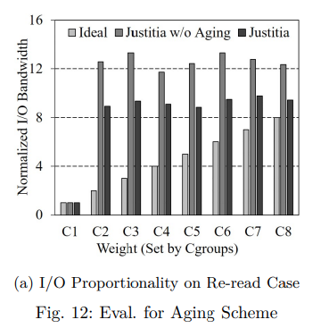

여기서 한 컨테이너 (C1) 의 I/O 가중치는 100이고 다른 컨테이너 (C2 - C8) 는 1000이다.

그림 12a와 같이 Justitia 의 I/O 비례도는 1 : 8.94 : 9.36 : 9.08 : 8.83 : 9.49 : 9.77 : 9.43이며 PV는 0.64이다.

반면 aging 기술이 없는 Justitia 는 PV 2.31 로 I/O 비례가 1 : 12.57 : 13.31 : 11.72 : 12.443 : 13.77 : 13.35이다.

aging 기술이 없는 Justitia 를 사용하면 C1 은 I/O 가중치가 높은 다른 컨테이너에 보상 없이 반복적으로 턴을 양보해 I/O 대역폭을 낮춰야 한다.

다만 Justitia 는 lock 획득 차례를 양보할 때마다 C1 의 I/O 가중치를 높이기 때문에 aging 기술이 없는 Justitia 에 비해 우수한 I/O 비례성을 보여준다.

따라서 가중치가 높은 컨테이너가 여러 개 있더라도 우리의 계획은 I/O 가중치에 따라 가중치가 낮은 컨테이너의 성능을 보장할 수 있다.

## 5. Related Work 

---

Cgroup 을 기반으로 I/O 리소스를 정확하게 제어하기 위한 새로운 체계를 제안했다.

가상화된 시스템에서 I/O 비례성을 개선하는 SSD 인식 I/O 스케줄러를 제안했다.

블록 계층 위에서 I/O 를 조절하여 NUMA 인식 확장 가능한 I/O 공유를 지원하는 Cgroups 의 기존 I/O 서브 시스템에 대한 대안을 제안했다.

그러나 이러한 체계는 페이지 캐시가 I/O 성능 향상에 크게 기여할 수 있음에도 불구하고 여전히 I/O 경로에 페이지 캐시 계층의 존재를 고려하지 않는다.

반면에 Justitia 는 페이지 캐시를 I/O 스택의 일부로 간주하고 버퍼링된 I/O 에서도 I/O 비례성을 크게 개선한다.

Cgroups 의 개선된 버전인 Cgroups v2 는 일정량의 dirty page 비율을 설정하여 다시 쓰기를 제어하는 기능을 제공한다.

그러나 Cgroups v2 는 I/O 가중치가 간단하고 사용자에게 친숙한 방법이지만 여전히 I/O 가중치로 페이지 캐시를 제어할 수 없다.

또한 Cgroups v2 는 페이지 할당에서 lock 메커니즘으로 인해 발생하는 문제를 해결할 수 없다.

종속성 문제로 인해 Cgroups v2 는 현재 도커 컨테이너에서 사용할 수 없다.

VM 별 페이지 캐시 분할 체계를 제안했다.

페이지 캐시 계층에서 VM 을 격리하여 적은 크기의 메모리로 적중률을 높인 것이 논문의 주요 기여이다.

가장 최근에 특정 정책에 따라 lock 대기열을 재정렬하는 셔플링 메커니즘을 제안했다.

이들은 NUMA 인식 기능을 통해 메모리 설치 공간과 같은 기존 lock 문제를 해결하는 데 주로 초점을 맞췄다.

반면 Justitia 는 장기적인 불공정성과 기아 문제를 일으키지 않고 페이지 캐시에 가중치를 부여함으로써 어플리케이션 수준의 I/O 비례성을 달성하는 데 기여하고 있다.

페이지 캐시를 사용할 때 컨테이너의 I/O 비례성을 개선하려고 시도하는 가중치 인식 페이지 캐시 관리를 제안했다.

그러나 페이지 할당 프로세스를 고려하지 않으므로 쓰기 집약적인 워크로드의 경우 더 나은 I/O 비례성을 제공할 수 없다.

게다가, 이 체계는 페이지의 소유권을 명확히 하지 않고 I/O 가중치만을 사용하기 때문에,

여러 컨테이너의 무게가 같은 경우에는 적용되지 않는다.

반면에 Justitia 는 페이지 할당 및 회수 단계에서 모두 가중치가 높은 컨테이너를 우선시하며,

페이지 캐시에서 구별하기 때문에 여러 컨테이너/어플리케이션의 가중치 값이 동일한 경우에도 사용할 수 있다.

마지막으로 “Weight-based page cache management scheme” 는 페이지 회수 동안 활성 목록에서 더 높은 가중치의 컨테이너에 더 많은 기회를 제공한다.

그러나 Justitia 는 각 컨테이너가 가져야 할 페이지 캐시 엔트리의 양을 정확하게 계산하여 페이지 회수에 활용한다.

## 6. Conclusion 

---

페이지 캐시는 높은 I/O 성능을 제공하는 데 중요한 역할을 한다.

하지만 기존의 Linux 페이지 캐시 관리는 cgroups 의 I/O 가중치를 페이지 할당과 회수 모두에 반영하지 않으므로 어플리케이션 수준 I/O 비례성이 저하된다.

따라서 이 논문에서는 (1) 페이지 캐시에서 페이지 할당 중 가중치가 높은 어플리케이션을 우선시하고 (2) 페이지 회수 중 I/O 가중치에 따라 페이지 캐시에서 각 어플리케이션의 할당된 페이지 수를 균형 있게 조정하는 Justitia 라는 새로운 페이지 캐시 관리 체계를 제시한다.

가상 벤치마크와 실제 벤치마크 모두를 사용한 실험 결과는 Justitia 가 현저한 성능 저하 없이 어플리케이션 레벨 I/O 비율을 효과적으로 향상시킨다는 것을 증명한다.

Justitia 의 소스 코드는 [github.com/kzeoh/Justitia.git](http://github.com/kzeoh/Justitia.git) 에서 확인할 수 있다.