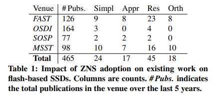

# Translate

***Don’t Be a Blockhead: Zoned Namespaces Make Work on Conventional SSDs Obsolete***

Zoned Namespace 로 인해 기존의 SSD 에서의 작업은 이제 없다.

[Abstract](#Abstract)

1. [Introduction](#Introduction)
2. [ZNS Device Dominate](#ZNSDeviceDominate)
    1. [A Quick Flash Primer](#AQuickFlashPrimer)
    2. [ZNS Costs Less per Gigabyte](#ZNSCostsLessperGigabyte)
    3. [ZNS Is a More Useful Abstraction](#ZNSIsaMoreUsefulAbstraction)
    4. [ZNS May Get Better Performance](#ZNSMayGetBetterPerformance)
    5. [ZNS SSD Adoption](#ZNSSSDAdoption)
3. [Reevaluating The Focus of SSD R&D](#ReevaluatingTheFocusofSSDR&D)
4. [Research Agenda](#ResearchAgenda)
    1. [Improving Performance](#ImprovingPerformance)
    2. [Managing Limitations](#ManagingLimitations)
5. [Conclusion](#Conclusion)

## Abstract 

---

Flash 디바이스에 대한 연구는 블록 인터페이스를 노출하는 기존 SSD 에 거의 초점을 맞추고 있다.

하지만 업계는 표준화를 거쳐 기존 SSD 를 압도하는 새로운 스토리지 인터페이스를 제공하는,

**ZNS (Zoned Namespace) SSD** 를 채택하고 있다.

따라서 기존  SSD 에 대한 지속적인 연구는

ZNS SSD 를 기반으로 시스템 성능을 한 단계 변화시킬 수 있는 기회를 놓치고 있다.

우리는 연구를 ZNS SSD 로 즉각적이고 완전하게 전환하고 연구 방향을 논의한다.

## 1. Introduction 

---

클라우드 및 데이터 센터 서비스는 대규모 데이터셋에 대한 짧은 지연 시간 액세스를 요구한다.

플래시 기반 SSD (Solid State Drive) 는 DRAM 보다 저렴한 비용으로

더 많은 용량을 제공하면서 하드 디스크 드라이브 (HDD) 보다 대기 시간이 훨씬 짧고

I/O 처리량이 더 높기 때문에 이러한 요구를 충족하는 데 매우 중요한 역할을 하게 되었다.

따라서 SSD 는 Caching 및 Key-value Storage 와 같이

대기 시간에 민감한 어플리케이션에 사용된다.

SSD 는 이제 매우 보편화되어 범용 파일 시스템과 같은 대기 시간에 민감한 어플리케이션도

SSD 를 기반으로 구축되며 클라우드 Provider 는 HDD 를 범용 VM 의 일부로 제공하지 않는다.

(일반적으로 범용 서버 블레이드에만 사용)

하지만 플래시 Storage 에는 명확한 물리적 한계가 있다.

삭제 블록의 플래시 셀 은 블록이 완전히 지워진 후에만 다시 쓸 수 있다.

플래시 셀은 각 쓰기 및 삭제 사이클에 따라 마모되고,

결국 데이터를 안정적으로 저장하는 능력을 상실하여 셀의 내구성을 제한한다.

기존 SSD 에서는 플래시 셀과 그 특성이, 기존 블록 인터페이스 뒤에 숨겨져있다.

이 인터페이스는 SSD 의 정교한 펌웨어 부분인, ***플래시 변환 계층 (FTL)*** 을 통해서 구현된다.

블록 인터페이스는 HDD 와 유사한 페이지 단위 (일반적으로 4KB) 에서,

임의로 작성할 수 있는 플랫 주소 공간을 호스트에 노출한다.

이 인터페이스는 응용 프로그램 개발자에게 친숙하고, 주요 운영체제에서 지원된다.

그러나 플래시 셀은 덮어쓸 수 없으며 삭제 블록 단위 (일반적으로 수 MB) 로 지워야 하기 때문에

랜덤 쓰기는 FTL 이 논리적 주소 공간에서 덮어쓴 이전 데이터로부터 공간을 회수하기 위해

가비지 컬렉션을 구현하도록 강제한다.

**가비지 컬렉션은 삭제 블록을 지우기 전에 유효한 데이터를**

**초과 프로비저닝된 (예비) 플래시 공간에 복사**한다.

이로 인해서 ***WAF (쓰기 증폭)*** 이 발생하며, 여기서 논리 주소 공간에 한 번 쓰여진 바이트는

물리적으로 플래시에 여러 번 기록된다.

WAF 는 과도한 쓰기 및 지우기 사이클을 사용하기 때문에 장치 수명을 줄인다.

동시에 **무효화될 데이터를 함께 배치하는 것**이 WAF 를 방지하기 위한 핵심이다.

불행히도 FTL 은 이러한 데이터 배치에 필요한 어플리케이션 레벨 정보에 접근할 수 없고,

어플리케이션은 FTL 이 장치에서 데이터를 배열하는 방법을 제한적으로 제어할 수 있다.

기존 SSD 의 블록 인터페이스로 인한 악영향을 관리하기 위해 상당한 연구가 진행되었다.

여기에는 가비지 수집 및 기타 FTL 작업으로 인한 성능 저하 및 예측 불가능성 관리에 대한

많은 연구들이 포함된다.

이전 연구에서는 FTL 의 내부 작업에 가장 잘 맞는 액세스 패턴을 찾기 위해 FTL 을 역설계하였다.

시스템은 또한 워크로드가 높은 WAF 를 일으키기 때문에,

플래시 장치의 수명을 연장하기 위해 플래시 쓰기를 자주 조절한다.

이 논문은 오늘날 시스템 커뮤니티가 ***기존의 SSD 에 대한 연구를 중단해야 한다*** 고 주장한다.

우리의 노력은 ZNS (Zoned Namespace) SSD로 전환되어야 한다.

ZNS 는 거의 모든 면에서 기존 블록 인터페이스를 지배하는 새로운 SSD 인터페이스이다.

ZNS 의 장점은 데이터가 물리적 플래시에 기록되는 방식과 일치하는 인터페이스와 함께

플래시 하드웨어의 복잡한 세부 사항을 추상화한다는 점이다.

ZNS SSD 는 Zone 이라고 불리는 논리 영역으로 나뉜다.

쓰기는 모든 zone 으로 이동할 수 있지만 zone 안에서 순차적이어야 한다.

ZNS is reality: 2020년에 인터페이스 사양이 NVMe 표준에 추가되었고

ZNS SSD 는 여러 공급업체에서 구할 수 있으며 대규모 클라우드 제공업체에서 이를 채택하고 있다.

소프트웨어 측면에서 ZNS 호환 파일 시스템, key-value 저장소 및

개발 프레임워크의 목록이 늘어나면서 채택에 대한 장벽이 제거되고 있다.

**ZNS 인터페이스는 데이터가 쓰여지는 방식과 더 밀접하게 일치하기 때문에 FTL 은 더 얇다**.

기존 FTL 에 비해 더 거친 주소 변환을 수행하고, 가비지 컬렉션을 하지 않는다.

(즉, 훨씬 더 작은 페이지 단위 대신, 삭제 블록 단위로 수행)

결과적으로 가비지 컬렉션의 성능 변동성 및 기타 영향이 제거되고

FTL 의 성능 모델링 및 리버스 엔지니어링이 불필요하다.

호스트는 쓰기 확장을 제어하고 어플리케이션 인식 데이터 배치 및

I/O 스케줄링 결정을 내릴 수 있다.

가비지 컬렉션을 위해 과도하게 프로비저닝된 플래시 용량이 불필요하고

주소 변환에 DRAM 의 일부가 필요하기 때문에 장치는 더 저렴하다.

일부 ZNS 사용 사례에서는 FTL 이 전통적으로 수행하는 작업을 위해

호스트 리소스가 필요할 수 있다.

결정적으로, 개발자는 ZNS 어플리케이션을 사용하여 플래시 관련 작업에 투입할

시스템 리소스 (있는 경우) 수를 선택할 수 있다.

기존 SSD 에서 DRAM 과 과도하게 프로비저닝된 플래시 용량은

필요 여부에 관계없이 고정 비용이다.

SSD 에 대한 최신 시스템 문헌 조사를 실시하여 논문의 18%만이

ZNS SSD 로의 전환에 영향을 받지 않으며,

논문의 23% 는 ZNS 에 의해 단순화되거나 해결된 문제를 다루고 있다.

나머지 59% 의 논문은 업계가 불가피하게 비용 및 성능상의 이점을 위해

ZNS SSD 를 사용하는 쪽으로 전환하면 영향을 받거나 재검토가 필요할 것이다.

기존의 SSD 문제 대신 ZNS SSD 로 시스템을 더 저렴하고, 더 빠르고, 더 효율적으로 만드는 데

초점을 맞춰야 한다. 우리는 시스템 성능을 개선하고 ZNS SSD 가 도입한 특정 한계와

과제를 대상으로 하는 몇 가지 광범위한 연구 방향을 제안한다.

## 2. ZNS Devices Dominate 

---

Zoned Namespace SSD 는 가격이 저렴하고, 호스트에 더 유용한 추상화를 노출시키며,

더 나은 성능을 얻을 수 있는 등 거의 모든 면에서 기존 장치를 지배한다.

### 2.1 A Quick Flash Primer 

플래시 아키텍처. 플래시는 NAND 셀로 구성되어 있다.

셀은 프로그래밍된 전압 레벨 및 유지 전압 레벨 수에 따라

1. SLC
2. MLC
3. TLC
4. QLC
5. PLC

비트를 저장할 수 있다.

높은 용량을 얻기 위해 플래시 셀은 3차원으로 배열.

2차원으로 배열된 후 쌓는다. 높은 처리량을 달성하기 위해 읽기 및 쓰기 작업은

수천 개의 셀에 걸친 병렬 처리를 활용한다. 이 아키텍쳐는 깊은 다층 계층을 형성한다.

오류 수정 코드를 저장하기 위한 상당한 중복성을 포함하는 여러 개의 셀이 한 페이지를 형성한다.

여러 페이지가 삭제 블록을 형성하고 차례로 평면을 형성한다.

여러 평면이 마침내 채널 (or die) 을 형성한다.

***Reading and writing flash***

플래시는 읽기/쓰기/지우기 인터페이스를 제공한다.

**읽기는 페이지 단위(대부분 4KB)** 로 수행된다.

페이지를 쓰기(프로그래밍) 위해서는 먼저 지워야 한다.

삭제는 프로그래밍보다 몇 배 더 오래 걸린다. (TLC 의 경우 ~6배)

이 지연 시간을 숨기기 위해 **삭제는 블록 단위 (수십 MB)** 로 일괄 처리된다.

삭제 블록 내에서 빈 페이지가 남지 않을 때까지 페이지가 순차적으로 프로그래밍된다.

일반적으로 각 채널의 여러 평면에 걸쳐 여러 읽기/쓰기 작업이 병렬로 수행되도록 예약된다.

다중 레벨 셀 프로그래밍에는 훨씬 더 많은 단계가 수반되며,

제조업체들은 종종 병렬 처리를 더욱 개선하기 위해 이 geometry의 변형을 구현하여

삭제 블록 크기를 수백 MB 까지 증가시킨다.

***Conventional SSDs.***

기존 SSD 에서 플래시 변환 계층 (FTL) 은 장치 형상의 복잡성과 삭제 블록의 존재를 숨긴다.

인접한 논리 페이지가 서로 다른 시간에 작성되면

서로 다른 블록 오프셋 또는 다른 블록 및 평면에 매핑될 수 있다.

FTL 은 다음을 담당한다.

- 각 논리 주소를 채널, 평면, 삭제 블록 및 페이지의 계층 구조로 변환
- 가비지 컬렉션: 유효한 페이지와 유효하지 않은 페이지가 혼합된 삭제 블록
    
    (즉, 플래시에서 논리적으로 덮어쓴 페이지) 을 지울 때 FTL 은 유효한 페이지를
    
    사용 가능한 페이지가 남아 있는 삭제 블록으로 전달한 다음 이전 블록을 지운다.
    
- FTL 데이터 구조를 지속적이고 일관된 상태로 저장하여 전원 끄기 이벤트를 준비
- wear leveling: 모든 블록에 걸쳐 삭제 균형을 조정하여 삭제 블록이 최대한
    
    균일하게 마모되도록 한다.
    

***Zoned Namespace SSD.***

ZNS SSD 는 주소 공간을 영역별로 분할한다. 이 영역은 순차적으로만 쓸 수 있다.

가득 찬 경우 새 데이터를 수락하려면 먼저 재설정(삭제)를 해야 한다.

현재 쓰기 위치는 ***write pointer*** 로 추적된다.

Zone 은 빈 상태, 열린 상태, 닫힌 상태, 가득 참, 읽기 전용 및 오프라인 상태일 수 있다.

영역은 비어 있는 상태로 시작하여 가득 찰 때까지 열려 기록되었다가

다시 비어 있는 상태로 재설정되고 그 후에 다시 열 수 있다.

각 활성 zone 이 리소스를 소비하기 때문에 제한된 수의 영역만 한 번에 활성화 할 수 있다.

(예: 쓰기 버퍼) 그러나 모든 영역은 동시에 읽기 전용 모드 일 수 있다.

플래시 셀 오류는 재설정 후 zone의 길이를 줄이거나 zone을 오프라인으로 표시햐여

투명하게 처리된다.

Zone 은 적어도 삭제 블록만큼 크다. 예를 들어, 최근 연구에서 평가된 장치는

1GB Zone 을 사용하고 14개의 active zone 을 지원한다.

### 2.2 ZNS Costs Less per Gigabyte 

ZNS SSD 는 각 장치에 필요한 전용 리소스가 적기 때문에 비용이 크게 절감된다.

***Less on-board DRAM.***

기존 SSD 에서 FTL 은 주소 매핑 테이블(logical to physical) 과 가비지 컬렉션 메타데이터를

장치의 온보드 DRAM 에 보관한다.

ZNS SSD 에서 FTL 은 최소한의 DRAM 이 필요한 영역 단위로 주소 변환을 유지한다.

DRAM 오버헤드를 추정하기 위해 페이지를 4KB 라고 가정한다.

기존 SSD 에서 최적화된 매핑 테이블에는 페이지당 약 4바이트가 필요하다.

이는 현재 장치에서 플래시 TB 당 약 1 GB 의 온보드 DRAM 에 해당한다.

ZNS SSD 에서 FTL 은 zone 을 삭제 블록에 매핑한다.

블록당 4바이트의 오버헤드와 16MB 의 삭제 블록이 유사하다고 가정하면

최대 256KB 의 온보드 DRAM 만 있으면 된다.

ZNS 를 통해 더 복잡한 인터페이스를 구축하려면 호스트 자원이 필요하다.

***Less overprovisioning.***

기존 SSD 는 예비 용량으로 플래시 셀의 상당 부분을 예약한다.

이 overprovisioning 은 일반적으로, 사용 가능한 용량의 7~28% 이다.

FTL 은 이 여유 용량을 사용하여 가비지 컬렉션 오버헤드를 줄인다.

논리 주소를 덮어쓸 때 즉시 공간을 회수할 필요 없이 SSD 는

단순히 새 데이터를 깨끗한 플래시 페이지에 쓰고 주소 매핑을 업데이트할 수 있다.

가비지 컬렉션을 지연하면 블록 공간을 회수하기 전에

삭제 블록의 데이터가 무효화될 가능성도 높아진다.

랜덤 쓰기 워크로드 및 가변 overprovisioning 요인을 사용한 랩 실험에서

가비지 컬렉션의 WAF (기록된 추가 바이트) 는

overprovisioning 이 없는 15배에서, 최대 25% overprovisioning 시 약 2.5배까지 향상되었다.

플래시 셀이 장치에서 가장 비용이 많이 드는 부분이기 때문에 과도한 overprovisioning 은

SSD 가격을 상승시킨다.

zone 을 재설정하면 zone 의 삭제 블록이 항상 완전히 무효화되고 지워지기 때문에

ZNS SSD 는 가비지 컬렉션을 수행하지 않는다.

따라서 호스트는 거의 모든 플래시 용량에 액세스할 수 있다.

(일부는 불량 플래시 블록을 대체하기 위해 예약됨)

일부 어플리케이션이 호스트 측 가비지 컬렉션을 수행하지만 이 책임을 호스트로 이동하면

시스템 리소스가 모든 어플리케이션에 대해 고정되지 않고

어플리케이션의 필요에 따라 할당될 수 있다.

### 2.3 ZNS Is a More Useful Abstraction 

기존 SSD 가 제공하는 블록 인터페이스는 하드디스크 드라이브에 읽거나 쓰는 S/W 를

개발한 경험이 있는 사람이라면 누구나 친숙하다.

그러나 블록 인터페이스는 플래시의 쓰기 제약을 너무 많이 추상화한다.

따라서 어플리케이션에서 성능과 장치 내구성을 극대화하기 위해

I/O 패턴을 조정하기가 매우 어렵다.

ZNS SSD 에 의해 노출된 인터페이스는 사용이 간편하고

기기가 데이터를 처리하는 방식을 충실하게 표현하는 균형을 잘 맞춘다.

작성자는 어떤 영역에든 쓸 수 있지만, 각 영역은 순차적으로 작성되어야 한다.

이 얇은 인터페이스를 통해 어플리케이션은 플래시의 데이터 배치를

보다 효과적으로 제어할 수 있으므로 WAF 에 대한 제어가 향상된다.

> 기존 블록 인터페이스는 플래시의 Write 제약조건을 너무 추상화.
> 
> 
> 프로그램 작성이 어려움.
> 
> ZNS SSD 는 사용이 간편, 균형을 잘 맞춰줌.
> 

zoned 인터페이스는 위에 다른 추상화를 구축할 수 있다.

예를 들어, ZNS SSD 를 사용하여 호스트에 블록 인터페이스를 구현하는 것은 간단했다.

이 작업은 NVMe 표준의 단순 복사 명령의 도움을 받아

호스트가 장치 제어 데이터 복사 작업을 실행할 수 있다.

이 명령을 사용하면 영역을 지우기 전에 유효한 데이터를 복사하여

PCIe 대역폭을 사용하지 않으므로 기존 SSD 와 비슷한 성능을 사용할 수 있다.

장치의 인터페이스 위에 추상화를 구축하면 ZNS SSD 의 몇 가지 단점 중 하나인

호스트에 컴퓨팅 및 DRAM 부담이 어느 정도 전가된다.

그러나 호스트용으로 대용량 DIMM 을 구입하는 것은

각 SSD 에 있는 여러 개의 소형 임베디드 DRAM 칩보다 저렴하다.

또한 호스트는 어플리케이션 세부 사항에 대한 통찰력이 있기 때문에

온보드 FTL 보다 가비지 수집 및 기타 데이터 관리 작업을 더 잘 관리할 수 있다.

호스트는 다른 인터페이스를 구성하기 위해 추가 호스트 리소스 비용을

더 지불할지 여부를 선택할 수 있다.

> 장치 위에 추상화를 구축하면 호스트와 DIMM 에 부담이 전가된다.
> 
> 
> 하지만 SSD 온보드 DRAM 보다 DIMM 이 저렴하고,
> 
> 호스트가 온보드 FTL 보다 더 관리를 효율적으로 할 수 있다.
> 

ZNS 는 기존의 두 가지 추상화를 개선한 것이다.

Openchannel SSD 는 장치 형상을 호스트에 노출하여 데이터 배치에 대한

세밀한 제어를 가능하게 한다.

Zoned Namespace 는 Openchannel SSD 에서 얻은 교훈을 바탕으로

약간 더 높은 수준의 인터페이스를 표준화한다.

멀티스트림 쓰기 NVMe 지시문은 개념적으로 ZNS 와 유사하다.

호스트는 동일한 스트림 ID 로 쓰기와 관련된 레이블을 지정하고

장치는 각 스트림을 자체 삭제 블록 집합에 쓴다.

다중 스트림은 호스트가 기존 SSD 의 데이터 배치를 제한적으로 제어할 수 있는 해결책이다.

기존 장치의 높은 하드웨어 비용은 그대로 유지된다.

### 2.4 ZNS May Get Better Performance 

FTL 이 기존 SSD 에서 사용하는

주요 성능 전략 (쓰기 버퍼링 및 병렬화를 활용하기 위한 전략적인 쓰기 배치) 은

ZNS 장치에서도 동일하게 사용할 수 있다.

검증하기 위해 더 많은 연구가 필요하지만,

ZNS SSD 는 이러한 작업을 수행할 수 있을 뿐만 아니라

온보드 FTL 보다 더 나은 경우가 많다.

그러나 어플리케이션에 대한 정보가 거의 최적에 가까운 가비지 컬렉션의

주요 병목 현상이며, 기존 FTL 에는 이 정보가 없다는 것이 분명하다.

반면 호스트는 어플리케이션 인식 데이터 배치 결정을 내릴 수 있다.

호스트는 같은 영역에 기록하여 함께 지울 데이터를 제어할 수 있기 때문에

WAF 를 세밀하게 제어할 수 있다.

호스트는 데이터가 만료될 것으로 예상되는 시점을 기준으로 데이터를 영역으로 그룹화하여

쓰기 확장을 크게 줄일 수 있다.

또한 호스트는 어플리케이션 지식을 활용하여 더 나은 스케줄링 결정을 내릴 수 있다.

기존 SSD 에서 가비지 컬렉션은 I/O 를 방해하여 tail latency 를 증가시킨다.

가비지 컬렉션은 FTL 이 불투명한 내부 알고리즘을 사용하여 스케줄링하기 때문에

성능을 예측할 수 없게 만든다.

호스트는 ZNS SSD 의 공간을 명시적으로 회수하여 I/O 주변의 가비지 컬렉션을

스케줄링하여 성능을 예측하고 읽기 지연 시간을 줄인다.

초기 ZNS SSD 실험은 그 성능을 강조한다.

Western Digital 은 벤치마크에서 평균 읽기 지연 시간이 60% 단축되고

처리량이 3배 더 높다고 보고했다.

Western Digital 은 ZNS 를 통한 RocksDB 의 읽기 tail latency 가 2-4배 더 낮고

쓰기 처리량이 2배 더 높다고 보고한다.

CMU 연구원들은 RocksDB 의 WAF 가 ZNS SSD 에서,

5배에서 1.2배로 떨어지는 것을 보여주었다.

IBM 은 22배 더 낮은 tail latency 와 65% 더 높은 어플리케이션 처리량을 보고한다.

### 2.5 ZNS SSD Adoption 

ZNS 장치는 이미 일부 공급업체로부터 시장에 출시되었다.

모든 주요 SSD 제조업체는 작업 중인 ZNS 프로토타입을 보유하고 있고,

대부분은 몇 달 동안 하이퍼스케일러에서 테스트를 거쳤다.

> 하이퍼스케일러란 ?
> 
> 
> 컴퓨팅에서 이루어지는 대규모 확장에 관한 모든 것
> 
> “AWS 등과 같이 대규모 데이터센터를 운용하는 업체”
> 

한 하이퍼스케일러는 ZNS SSD 가 QLC 플래시를 구현하고 실현하는 데 있어

중요한 구성 요소라고 공유했다.

이러한 구축을 준비하기 위해 벡엔드 소프트웨어를 ZNS 와 호환되도록

상당한 투자가 이루어지고 있다.

두 번째 하이퍼스케일러는 스토리지 소프트웨어 스택을 ZNS SSD 로 포팅함으로써

성능을 공개적으로 공유했다.

오픈소스 세계에서 Linux 는 두 개의 네이티브 zone 파일 시스템 (ZoneFS 및 F2FS) 을 지원한다.

또한 메인 스트림 파일 시스템 Btrfs 및 ext4 는 ZNS SSD 에서 기본적으로 실행되는 것에 가깝다.

버전 4.14 를 기준으로 Linux 는 모든 ZNS SSD 위에 표준 블록 장치를 에뮬레이트 하는

*dm-zoned* 디바이스 매퍼를 제공한다.

또한 Ceph 및 RocksDB 와 같은 대규모 어플리케이션이

기본적으로 ZNS SSD 를 사용하도록 포팅되면서 상당한 성능 향상을 실현했다.

커널 바이패스 스토리지 어플리케이션을 개발하기 위한 프레임워크인

SPDK (Storage Performance Development Kit) 는 버전 20.10 부터 ZNS 를 지원한다.

## 3. Reevaluating The Focus of SSD R&D 

---

이러한 기술 변화가 향후 시스템 연구에 미칠 영향을 이해하기 위해

OS 및 스토리지 컨퍼런스에 발표된 플래시 및 SSD 에 대한 최근 연구를 조사한다.

구체적으로, 우리는 ZNS 장치가 지배적인 미래에도 이 연구를 계속 수행할 수 있을지 관심이다.

분명히 말씀드리면, 우리는 논문의 가치나 영향에 대해 의문을 갖지 않는다.

이러한 작업들은 기존 SSD 로 실제 문제를 해결하며

지금까지 이러한 문제를 피할 수 있는 비슷한 가격의 대안이 없었다.

그러나 ZNS 는 이를 변화시키고, 우리는 이에 따라 우리의 연구 의제를 재평가해야 하며,

그렇지 않으면 불필요하게 신기술 사용을 최대한 연기해야 한다.

따라서 우리의 연구는 시스템 커뮤니티가 기존 SSD 에 대한 작업을 계속할 경우

잘못 지시될 수 있는 노력을 정량화하는 것을 목표로 한다.

FAST, OSDI, SOSP 및 MSST 에서 지난 5년간 발표된 논문을 조사한다.

총 465편의 논문을 수집하여 플래시 기반 SSD 가 연구 또는 시스템 구현에서

중요한 부분을 차지하는 104편의 논문으로 압축했다.

우리는 이 논문들을 수동으로 분류했다.

이것은 완전한 설문조사가 아니다.

우리의 목표는 최근 시스템 연구의 대상에 대한 폭넓은 감각을 얻는 것이다.

초저지연 SSD (예: 삼성 Z-NAND) 및 비휘발성 메모리 (예: 3D XPoint) 에 대한 논문은

기존 플래시 SSD 와 다른 시스템 의미를 갖기 때문에 생략한다.

우리는 논문에 대해 네 가지 광범위한 범주를 정의한다.

(bold 체는 표 1 의 열 머리글)

- **Simpl**ified/Solved : 이 논문의 주요 문제는 ZNS SSD 로 해결 또는 단순화 된다.
    
    예를 들어, 플래시 시뮬레이터용 FTL 구축 또는 가비지 컬렉션 개선
    
- **Appr**oach : 문제 해결에 대한 본 논문의 접근 방식은 ZNS 에 따라 변경될 수 있다.
    
    예를 들어, 시스템 구현이 변경될 수 있다.
    
- **Res**ults : 연구 또는 평가의 결과가 변경될 수 있다.
    
    예를 들어, 시스템 성능이 변경되거나 측정 연구의 결과가 달라질 수 있다.
    
- **Orth**ogonal : 논문에서 다루는 문제는 ZNS 와 직교한다.
    
    예를 들어, 플래시에 대한 낮은 수준의 보안 기술을 제안한다.
    

테이블1 : ZNS 도입이 플래시 기반 SSD 의 기존 작업에 미치는 영향. (Column은 개수)

#Pubs. 지난 5년간 행사장에서 발행된 총 출판물을 나타낸다.

분류법은 표 1과 같다.

SSD 논문의 23% 가 ZNS 를 단순화하거나 해결하는 문제에 초점을 맞추고 있다.

이 범주의 논문은 가비지 컬렉션의 부정적인 성능 영향을 완화하거나

기기 내구성을 보존하기 위한 WAF 관리에 초점을 맞추고 있다.

다른 논문들은 FTL 을 리버싱 하거나 재설계하여 성능 가변성을 줄인다.

FTL 이 더 단순하기 때문에 ZNS SSD 에서는 훨씬 간단하다.

추가로 59% 의 SSD 논문이 ZNS SSD 와 마찬가지로 접근 방식을 변경하거나

결과를 재검토해야 한다.

중요한 플래시 구성 요소를 갖춘 많은 시스템은 ZNS 에 맞게 재설계되어야 한다.

플래시 의존도가 높은 시스템은 ZNS 로 포팅한 후

다른 내구성이나 성능 특성을 보일 수 있으므로 다시 평가해야 한다.

현장 또는 극한의 워크로드에서 장치 동작을 특성화하는 성능 및 신뢰성 측정 연구는

ZNS SSD 를 포함하는 시스템의 특성을 제대로 파악하기 위해 다시 실행해야 한다.

## 4. Research Agenda 

---

이제 ZNS 가 표준화되었고 기기를 상업적으로 사용할 수 있게 되었으므로

이번에는 ZNS 와 함께 기존 SSD 에 대해 했던 많은 질문을 다시 살펴보고

이 기술을 시스템에 가장 잘 통합하는 방법에 대해 새로운 질문을 던질 차례이다.

이 섹션에서는 먼저 가비지 컬렉션을 호스트의 어플리케이션과 함께 배치하여

성능을 향상시킬 수 있는 몇 가지 기회에 대해 설명한다.

그런 다음 ZNS 의 새로운 인터페이스에 의해 도입된 몇 가지 과제에 대해 설명한다.

### 4.1 Improving Performance 

*How can application-level information improve zone management?*

*어플리케이션 레벨 정보는 어떻게 zone 관리를 개선할 수 있을까?*

어플리케이션 및 액세스 패턴에 대한 정보는 삭제 블록 및 zone 에 쓰기를 할당할 때 중요하다.

삭제 블록에 쓴 대부분의 데이터가 동시에 만료되는 경우 가비지 컬렉션 오버헤드는 최소화된다.

소프트웨어는 종종 데이터 만료에 대해 경험에 근거한 추측을 할 수 있다.

예를 들어, 같은 파일의 페이지는 다른 파일의 페이지보다 함께 삭제되거나 덮어쓰기 쉽다.

비슷한 시간에 생성된 파일도 함께 만료될 가능성이 높다. (예: 분석 워크로드의 중간 파일)

더 높은 수준에서는 동일한 어플리케이션, 컨테이너 또는 가상 시스템에서 생성된 파일 집합이

서로 다른 생성자와 소유자를 가진 파일(예: 어플리케이션이 종료되거나 가상 시스템이

마이그레이션 또는 종료되는 경우)에 비해 동시에 만료될 가능성이 더 높다.

이 중요한 정보는 기존 SSD 에서 사용할 수 없었다.

이러한 정보 장벽은 거의 최적화된 가비지 컬렉션 알고리즘을 사용하더라도

FTL 을 최적이 아닌 성능으로 제한해 왔다.

파일 시스템은 이 정보를 쉽게 사용할 수 있고, ZNS SSD 와 함께 사용할 수 있다.

그러나 현재 ZNS SSD (예: F2FS) 용 Linux 커널 파일 시스템은 아직 이 정보를 사용하지 않는다.

결과적으로, 이것은 탐구를 위한 풍부한 주제이다.

파일 시스템 지식(소유자, 작성자, 타임스탬프)이 쓰기 확장을 얼마나 줄일 수 있는가?

파일 시스템 이외에 어플리케이션 정보가 오버헤드를 얼마나 더 줄일 수 있는가?

추가 정보를 고려할 때 이론적으로 최적의 가비지 컬렉션 알고리즘은 어떻게 변경되는가?

*How should applications interact with zones?*

*어플리케이션이 zone 과 어떻게 상호 작용해야 하는가?*

[섹션 2.3](https://www.notion.so/Translate-a86d08cc74c84d498c155b4e454eb6c7) 에서는 어플리케이션이 ZNS SSD 에 액세스할 수 있는 인터페이스에 대해 설명한다.

이러한 각 인터페이스는 성능과 사용 편의성을 절충한다.

raw zoned 스토리지 액세스는 I/O 및 데이터 배치에 대한 가장 많은 제어를 제공한다.

파일 시스템 및 key-value 저장소는 제어력은 낮지만 사용하기 쉽다.

(예: 많은 파일 시스템이 메타데이터 관리 및 데이터 무결성을 처리한다.)

인터페이스 클래스 내에서도 다양성이 있다.

예를 들어, F2FS 는 모든 기능을 갖춘 POSIX 호환 파일 시스템인 반면,

ZoneFS 는 zone 을 zone 자체와 동일한 제한이 있는 파일로 취급한다.

raw zoned 저장소는 커널을 통과하거나 통과하지 않을 수 있다.

마지막으로 개별 어플리케이션에는 성능을 위해 조정할 수 있는 구성이 있다.

(예: ZNS 지원 RocksDB 의 active zone 개수)

플래시의 제한된 내구성은 기존 SSD 와 블록 인터페이스에서 볼 수 있듯이

단순히 성능을 넘어 잘못된 인터페이스를 사용하는 데 비용이 발생했다는 것을 의미한다.

Zoned 스토리지(예: SMR HDD)는 ZNS 이전에 존재했지만

플래시 장치와 동일한 내구성 제한을 겪지 않는다.

따라서 I/O 성능, 유용성 및 장치 내구성을 최대화하는 방식으로

Zoned 플래시 장치와 상호 작용하는 방법이 완전히 탐구되지 않았다.

일반적으로 어플리케이션들은 Zone 인터페이스, 파일 시스템, 또는 다른 API 를

사용하는 것을 선호하는가?

내구성, 성능 및 사용적합성 트레이드오프를 다른 용도와 시스템 설정에 대해

명시하는 최선의 방법은 무엇인가?

다양한 인터페이스(및 인터페이스 구성)로 실험하는 프로세스를 어떻게 최대한

pain-free 하게 만들 수 있는가?

*What is the best approach to I/O scheduling with hostdriven device management?*

*호스트 기반 장치 관리를 통해 I/O 스케줄링을 하는 가장 좋은 방법은 무엇인가?*

**기존 SSD 에서는 가비지 컬렉션 시기를 OS 나 어플리케이션 모두 알 수 없었다.**

이로 인해 기존 SSD 에 대한 I/O 요청의 지연 시간을 예측하고

느린 요청을 방지하기 위해 여러 SSD 를 사용하는 등 복잡한 해결 방법이 마련되었다.

**ZNS SSD 를 사용하면 대역폭 공유를 넘어 개별 Zone 의 성능이 서로 독립적이다.**

(대역폭은 이미 현재 2세대 PCIe4 SSD 를 사용하고

가까운 장래에 제공되는 PCIe5 제품의 제한 사항은 훨씬 줄어들 것이다.)

따라서 호스트는 완전히 제어되며 Zone 삭제 및 유지 보수 작업을 정확하게 스케줄링할 수 있다.

이러한 유연성 덕분에 새로운 정책이 다른 목표보다 우선 순위를 정할 수 있다.

예를 들어, 쓰기 지연 시간보다 읽기 지연 시간 및 WAF 가 우선시된다.

또한 이러한 정책은 Zone 집합에 따라 다를 수 있으므로

여러 어플리케이션 또는 테넌트를 효율적으로 공동 배치할 수 있다.

- 어플리케이션 개발자가 이러한 목표와 선호하는 트레이드오프를
    
    어플리케이션 또는 OS 에 전달하기 위한 인터페이스는 무엇인가?
    
- 개발자는 원칙에 따라 이러한 절충안을 어떻게 선택하는가?
    
    (tradeoffs 를 어떻게 선택하는가?)
    

*How can we best exploit transparent data placement?*

*투명한 데이터 배치를 어떻게 가장 잘 활용할 수 있는가?*

기존 SSD 에서 어플리케이션은 FTL 이 의도한 대로 데이터를 배치하도록 하는

트릭에 의존해야 한다.

예를 들어, 대규모 플래시 캐싱 어플리케이션은 객체의 여러 버킷을 유지 관리하며,

각 버킷은 동일한 삭제 블록에 기록되어야 한다.

기존 SSD 에서 동시 쓰기 작업은 논리 주소 공간에서 멀리 떨어져 있더라도

삭제 블록에 **interleave** 된다.

어플리케이션들은 DRAM 을 버퍼로 사용하여 많은 쓰기를

하나의 매우 큰 쓰기로 통합하도록 발전해 왔다.

ZNS SSD 에서는 이러한 버퍼가 더이상 필요하지 않다.

- 이러한 어플리케이션을 어떻게 식별하고 수정하여
    
    낭비되는 DRAM 을 회수할 수 있는가?
    
- 이러한 어플리케이션에 적용되는 공통적인 추상화가 있는가?

### 4.2 Managing Limitations 

*How should hosts manage active zone limits?*

*호스트는 active zone 제한을 어떻게 관리해야 하는가?*

현재 ZNS SSD 는 동시에 쓸 수 있는 zone 의 수를 제한한다(Section 2 참조).

이러한 제한은 이미 사용 가능한 플래시 대역폭을 완전히 사용할 수 있을 만큼 병렬화가 가능한

기존 커널 파일 시스템 구현에서는 문제가 되지 않는다.

그러나 ZNS SSD 가 커널을 우회하는 여러 어플리케이션 간에 분할되면 문제가 된다.

간단한 전략은 고정된 active zone 예산과 함께 각 어플리케이션에 고정된 수의 zone 을

할당하는 것이다.

그러나 이 접근 방식은 부족한 리소스의 다중화를 허용하지 않기 때문에

일반적인 bursty 워크로드에는 확장되지 않는다.

- 요청 시 Zone 을 동적으로 할당하는 좋은 전략이 있는가?
- 제조업체가 적당한 on-device 리소스 요구 사항을 감안할 때,
    
    더 많은 Zone 이 있는 디바이스를 만들 것이라고 가정할 때 충분한 Zone 수는 얼마인가?
    

*Are there workloads that perform worse on ZNS SSDs than on conventional SSDs?*

*ZNS SSD 에서 기존 SSD 보다 성능이 떨어지는 워크로드가 있는가?*

사양이 확정된 후 프로토타입에서 발견된 ZNS SSD 의 잘 알려진 워크로드 문제 중 하나는

**Zone 의 쓰기 포인터가 lock 경합을 겪을 수 있다**는 것이다.

persistent queue 및 추가 전용 데이터 구조와 같이 쓰기가 단일 영역에 집중되는

Multi-writer 워크로드에 대한 문제이다.

이 문제는 쓰기 포인터를 이동하는 책임을 호스트 측 소프트웨어로 이동하기 때문에 발생한다.

*ZNS 명세에 추가하면 이 문제가 해결된다:*

이 명령을 사용하면 오프셋을 지정하지 않고 장치가 동일한 영역에 동시 쓰기를 직렬화할 수 있다.

ZNS 인터페이스의 참신함과 지금까지의 제한된 하드웨어 배치를 고려할 때,

기존의 SSD 보다 ZNS 에서 더 나쁜 성능을 낼 수 있는 다른 워크로드가 있는지의 여부는

여전히 미해결 문제로 남아있다.

- 대표적인 워크로드와 합성 워크로드를 체계적으로 테스트하여
    
    ZNS 보다 성능이 떨어지는 워크로드가 있는지 확인할 수 있는가?
    
- ZNS 사양의 확장으로 성능을 수정할 수 있는가?

*How do ZNS SSDs fit with recent trends to offload I/O tasks from the host to dedicated hardware?*

*호스트에서 전용 하드웨어로 I/O 작업을 오프로드 하는 최신 동향에*

*ZNS SSD 는 어떻게 적합한가?*

하이퍼스케일러는 호스트에 책임을 전가하는 ZNS SSD 를 수용하는 동시에

호스트 CPU 에서 전용 하드웨어로 I/O 처리를 오프로드하고 있다:

- AWS 의 ASIC, MS 의 ARM SoC, 그리고 Alibaba 의 FPGA

시스템 설계 철학의 이러한 명백한 모순은 학문적 정밀조사를 필요로 한다.

Facebook 의 계산 오프로드용 Accelerometer 와 유사하게, 우리는 하드웨어 스택의 어느 부분이

I/O 제어 및 데이터 경로에서 어떤 기능을 담당해야 하는지 결정하는 방법에 대한

연구를 구상한다.

## 5. Conclusion 

---

많은 SSD 연구가 기존 SSD 의 문제에 초점을 맞추고 있는 반면,

업계는 Zoned Namespace 를 표준화하고 채택하기 시작하면서 앞서나가고 있다.

이 변곡점은 이러한 새로운 기기를 최대한 활용하는 방법에 대한

흥미롭고 영향력 있는 연구 방향을 열어준다.

또한 시스템 커뮤니티가 직면한 문제를 지적한다.

많은 연구가 대규모 클라우드 공급자와 같은 설정을 대상으로 하고 있지만,

종종 업계 또는 긴밀한 관계를 가진 사람들만이

새로운 기술과 문제에 접근할 수 있는 권한을 가진다.

이것은 그러한 연줄이 없는 연구자들에게 불이익을 주지만,

또한 현장 전체에 해를 끼친다. 관련 문제에 대한 접근이 제한되고

가장 시급한 문제를 공격하는 사상가의 다양성이 줄어들 때 진보는 방해받는다.

온라인 워크샵과 컨퍼런스의 이 시대는 참여 장벽을 낮춘다.

우리는 주최 측이 전세계 다양한 기관의 연구원들의 참여를 장려하고

새로운 동향과 과제에 대한 논의를 비공식적인 방법으로 산업 패널을 구성함으로써

이점을 누릴 수 있기를 바란다.