# translate

[Abstract](#Abstract)

1. [Introduction](#Introduction)
2. [Background and Motivation](#[BackgroundandMotivation)
    1. [FaaS Container Workflows in Alibaba Cloud Function Compute](#FaaSContainerWorkflowsinAlibabaCloudFunctionCompute)
    2. [Workload Analysis](#WorkloadAnalysis)
        1. [Workload Burstiness](#WorkloadBurstiness)
        2. [Cold Start Costs of Containerized Functions](#ColdStartCostsofContainerizedFunctions)
3. [FaaSNet Design](#FaaSNetDesign)
    1. [Design Overview](#DesignOverview)
    2. [Function Trees](#FunctionTrees)
    3. [Function Tree Integration](#FunctionTreeIntegration)
    4. [FT Design Discussion](#FTDesignDiscussion)
4. [Evaluation](#Evaluation)
    1. [Experimental Methodology](#ExperimentalMethodology)
    2. [FaaS Application Workloads](#FaaSApplicationWorkloads)
    3. [Scalability and Efficiency](#ScalabilityandEfficiency)
    4. [Impact of Function Placement](#ImpactofFunctionPlacement)
    5. [I/O Efficient Data Format](#I/OEfficientDataFormat)
    6. [On-Demand I/O: Sensitivity Analysis](#On-DemandI/O:SensitivityAnalysis)
5. [Discussion](#Discussion)
6. [Related Work](#RelatedWork)
7. [Conclusion](#Conclusion)

## Abstract 

---

서버리스 컴퓨팅(FaaS) 은 사용자가 fine-grained 기능을 배치하는 동시에 완벽하게 관리되는

resource provisioning 및 auto-scaling 기능을 제공함으로써

새로운 방식의 어플리케이션 구축 및 확장을 가능하게 한다.

> fine-grained : 하나의 작업을 여러 프로세스로 나눈 것
> 

커스텀 FaaS 컨테이너 지원은 FaaS 어플리케이션의 현대화를 위한 OS 제어,

버전 관리, 툴링 등을 개선할 수 있어 큰 시장 수요를 얻고 있다.

하지만 컨테이너 provisioning 은 비용이 많이 들고,

실제 FaaS 워크로드는 매우 동적인 패턴을 나타내기 때문에

신속한 컨테이너 provisioning 을 제공하는 것은 FaaS provider 에게 중대한 문제를 야기한다.

이 논문에서 우리는 FaaS 컨테이너 provisioning 을 가속화하기 위해

확장성이 뛰어난 미듦웨어 시스템인 FaaSNet 을 설계한다.

FaaSNet 은 세계 최대 클라우드 제공 업체 중 하나인 알리바바 클라우드 Function 컴퓨팅의

FaaS 플랫폼 워크로드 및 인프라 요구사항에 따라 운영된다.

FaaSNet 은 가벼운 적응형 function tree 구조를 통해

확장 가능한 컨테이너 provisioning 을 가능하게 한다.

FaaSNet 은 대규모 provisioning 비용을 줄이기 위해,

on-demand fetching 메커니즘을 통해 I/O 를 효율적으로 사용한다. 

우리는 FaaS 를 알리바바 클라우드 Function 컴퓨팅에서 구현하고 통합한다.

평가 결과에 따르면 FaaSNet 은

1. 1,000대의 가상 머신에 2,500개의 function 컨테이너 provisioning 을 8.3초만에 완료하고,
2. 알리바바 클라우드의 현재 FaaS 플랫폼과 최첨단 P2P 컨테이너 레지스트리보다
    
    13.4배 및 16.3배 빠르게 확장
    
3. 최적화된 기준보다 75.2% 적은 시간을 사용하여 버스트 워크로드를 유지한다.

## 1. Introduction 

---

최근 몇 년 동안 서버리스 컴퓨팅 또는 ***Function-as-a-Service (FaaS)*** 이라는

새로운 클라우드 컴퓨팅 모델이 등장했다.

서버리스 컴퓨팅은 개발자가 기존의 단일 서버 기반 어플리케이션을

세분화된 클라우드 기능으로 세분화함으로써 어플리케이션과 서비스를

구축하고 확장하는 새로운 방식을 가능하게 한다.

서비스 공급자가 기능이 실행되는 백엔드 서버를 provisioning, scaling 및 관리하는

지루한 작업을 수행하는 동안 개발자는 function 로직을 작성한다.

서버리스 컴퓨팅 솔루션은 그 인기가 높아지면서 상용 클라우드와

(예: AWS 람다, Azure Functions, Google Cloud Functions 및 Alibaba Cloud Function Compute 등)

오픈 소스 프로젝트(예: Open Whisk, Knative)로 진출하고 있다.

AWS 람다 및 Google Cloud Functions 와 같은 서버리스 플랫폼은

.zip 아카이브로 패키지된 Functions 을 제공하지만,

이 배포 방법은 유연성이 부족한 FaaS 어플리케이션에 제약이 있다.

한 가지 제약 조건은 **최대 패키지 크기 제한**이다.

(AWS 람다 Functions 에서, 압축되지 않은 패키지는 최대 크기 250MB까지 가능)

최근 트렌드는 커스텀 ***컨테이너 이미지를 사용하여 클라우드 functions 을 패키징 및 배치*** 하는 것이다.

이 접근 방식은 가용성, 이식성 및 툴링 지원을 크게 향상시키므로 바람직하다.

1. 클라우드 Functions 을 컨테이너 런타임에 따라 배포할 수 있게 하면,
    
    큰 의존성을 가지는 머신러닝, 데이터 분석, 비디오 처리와 같은 어플리케이션들에 대해
    
    흥미로운 시나리오들이 가능하다.
    
    이것은 제한된 Functions 패키지 크기로는 불가능했을 것이다.
    
2. 컨테이너 툴링 (예: Docker) 은 소프트웨어 개발 및 테스트 절차를 간소화한다.
    
    따라서 컨테이너 도구에 익숙한 개발자는 동일한 접근 방식을 사용하여
    
    FaaS  어플리케이션을 쉽게 구축하고 배치할 수 있다.
    
3. 이 접근 방식은 FaaS 어플리케이션 개발을 위한 incremental 업데이트와 같은,
    
    새로운 DevOps 기능을 활성화한다.
    

> incremental update : 전체가 아닌, 차이점만 업데이트
> 

FaaS 모델을 매력적으로 만드는 잠재적인 이점은 필수적인 **리소스 탄력성 (Resource elasticity)** 이다.

이상적인 경우, 유저 어플리케이션은 사전 통지 없이 몇 초 안에 on-demand 방식으로

수만 개의 클라우드 functions 을 확장 (scale up) 할 수 있어야 한다.

그러나 커스텀 컨테이너 기반 FaaS 인프라에 대해, 신속하게 컨테이너 provisioning 을 제공하는 것은

중요한 문제를 야기한다.

**첫째, FaaS 워크로드는 매우 역동적이고 bursty 한 패턴을 보인다.**

> bursty : 간헐적으로 데이터를 주고 받음 ↔ stream 과 대비
> 

이를 검증하기 위해 세계 최대 클라우드 제공업체 중 하나인 알리바바 클라우드가 관리하는

production serverless 컴퓨팅 플랫폼의 FaaS 워크로드를 분석했다.

우리는 단일 어플리케이션의 Functions 요청 처리량 (초당 동시 호출 요청 수 RPS 측면에서) 이

500배 이상의 peak-to-trough 비율로 최대 1,000 RPS 이상으로 급증할 수 있음을 관찰했다.

> peak-to-trough ratio : 고점과 저점의 비율
> 

일반적으로 FaaS 플랫폼은 급증한 요청을 처리하기 위해 요청이 들어왔을 시

많은 가상화 환경 (Function Compute 의 경우 컨테이너형 Function 을 Hosting 하고 격리하는 VM)

을 시작한다. 클라우드 Functions 을 호스팅하는 수백 개의 VM 이

백업 저장소 (컨테이너 레지스트리 또는 object 저장소) 에서 동일한 컨테이너 이미지를 가져올 때,

워크로드가 급증하면 네트워크 대역폭 병목 현상이 발생한다.

결과적으로, 컨테이너 startup 프로세스의 높은 cost 는

FaaS provider 가 높은 elasticity 을 보장하기 매우 어렵게 만든다.

**둘째, 커스텀 컨테이너 이미지는 크기가 크다.**

예를 들어, 도커 허브에 있는 컨테이너의 10% 이상이 1.3GB 보다 크다.

백업 저장소에서 대형 컨테이너 이미지를 끌어오면 **cold startup 레이턴시**가 확연히 생기고,

이 지연 시간은 백업 저장소가 high contention 인 경우 (경합이 심한 경우)

최대 몇 분 (섹션 2.2.2 참조) 까지 소용될 수 있다.

기존 솔루션은 당사의 FaaS 플랫폼에 직접 적용할 수 없다.

Kraken, DADI 및 Dragonfly 와 같은 솔루션에서는 P2P 접근 방식을 사용하여

규모에 맞는 컨테이너 provisioning 을 가속화하지만,

데이터 seeding 과 메타데이터 관리 및 조정을 위한 루트 노드 역할을 하는

하나 이상의 강력한 전용 서버가 필요하다.

> data seeding : 초기 데이터 set 으로 채우는 것, 테스트하기 위한 DB 삽입
> 
> 
> 일반적으로 어플리케이션의 초기 설정 시 초기 사용자 계정 또는
> 
> 더미 데이터와 같은 시드 데이터를 로드하는 것이 일반적
> 

이러한 P2P 기반 접근 방식을 기존 FaaS 인프라에 직접 적용하는 것은

다음과 같은 이유로, 이상적인 솔루션이 아니다.

1. 추가적인, 전용 중앙 집중식 컴포넌트가 필요하므로 성능 병목 현상이 생기는 동시에
    
    provider 의 총 소유 비용 (TCO) 이 증가한다.
    

> TCO : Total Cost of Ownership
> 
1. FaaS 인프라는 리소스가 제한된 VM 의 동적 pool 을 사용하여
    
    강력한 격리를 위해 컨테이너화된 클라우드 Functions 을 호스팅한다.
    
    이러한 역동성을 위해서는 기존 솔루션이 지원하지 못하는,
    
    적응력이 뛰어난 솔루션이 필요하다.
    

이러한 문제를 해결하기 위해 serverless 컨테이너 provisioning 을 가속화하기 위한

가볍고 적응력이 뛰어난 미들웨어 시스템인 FaasNet 을 제시한다.

FassNet 은 function-based tree structure 로 구성된 호스트 VM 전체에

컨테이너 provisioning 프로세스를 분산시킴으로써 높은 확장성을 지원한다.

function tree (FT) 는 논리적 트리 기반 네트워크 overlay 이다.

FT 는 여러 호스트 VM 으로 구성되며 컨테이너 런타임 또는 코드 패키지를 확장 가능한 방식으로

모든 VM 에 분산시킬 수 있다.

FaaSNet 은 VM joining 과 leaving 을 수용하기 위해

FT 토폴로지를 동적으로 조정하는 트리 밸런싱 알고리즘을 통해 높은 적응성을 지원한다.

FaaSNet 의 설계는 알리바바 클라우드 functions 컴퓨팅의 특정 워크로드와

인프라 요구사항에 의해 주도된다는 점에 유의하자.

예를 들어, Function Compute 는 VM 내부의 컨테이너를 사용하여

강력한 tenent-level 분리를 제공한다.

일반적인 FaaS VM pool 에는 수천 개의 소형 VM 인스턴스가 있다.

FaaS VM pool 의 규모와 FaaS 워크로드의 고유한 특성에 따라

(1) 중앙 집중식 컨테이너 스토리지는 확장되지 않을 수 있으며,

(2) 기존 컨테이너 배포 기술은 워크로드 유형과 기본 클러스 리소스 구성에 대해

서로 다른 가정을 가지고 있기 때문에 우리 환경에서 제대로 작동하지 않을 수 있다.

본 논문에서 우리는 다음과 같은 기여를 한다.

- 우리는 FaaS 에 최적화된 커스텀 컨테이너 provisioning 미들웨어 시스템의 설계를 제시한다.
    
    FaaSNet 의 핵심은 중앙 병목 현상을 피하는 적응형 function tree 의 추상화이다.
    
- 우리는 알리바바 클라우드 Function Compute 에서 FaaSNet 을 구현하고 통합한다.
    
    FaaSNet 은 우리가 아는 한, 공개된 기술 세부사항을 가진 클라우드 provider 의
    
    첫 번째 FaaSNet 컨테이너 provisioning 시스템이다.
    
- 우리는 알리바바 클라우드 Funtion Compute 에 FaaSNet 을 배치하고
    
    production 워크로드와 microbenchmark 모두를 사용하여 FaaSNet 을 광범위하게 평가한다.
    
    실험 결과에 따르면 FaaSNet 은 8.3초 이내에
    
    2,500 개의 Function 컨테이너의 provisioning 을 완료하고,
    
    (단일 컨테이너를 provisioning 하는 것보다 1.6배 더 길다)
    
    알리바바 클라우드의 현재 FaaS 플랫폼과 최첨단 P2P 레지스트리(Kraken) 보다
    
    13.4배, 16.3배 더 빠르게 확장되며, 각각 최적화된 기준보다 75.2% 적은 시간을 사용하여
    
    bursty 워크로드를 유지한다.
    
- https:// [github.com/mason-leap-lab/FaaSNet](http://github.com/mason-leap-lab/FaaSNet) 에서
    
    FaaSNet 의 FT 와 프로덕션 FaaS cold start trace 가 포함된 데이터 세트를 공개한다.
    

## 2. Background and Motivation 

---

이 섹션에서는 먼저 알리바바 클라우드 Functions Compute 의

FaaS 컨테이너 workflow 에 대한 개요를 제공한다.

그런 다음 확장 가능하고 탄력적인 FaaS 컨테이너 런타임 provisioning 시스템의

bursty 패턴과 요구사항을 강조하기 위해 FaaS 워크로드에 대한 동기 부여 연구를 제시한다.

### 2.1 FaaS Container Workflows in Alibaba Cloud Function Compute 

---

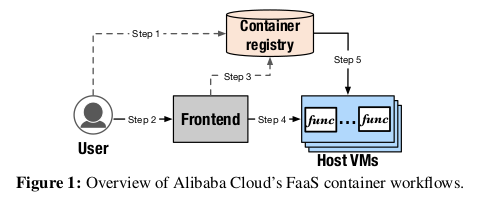

Function Compute 를 통해 사용자는 사용자 지정 컨테이너 이미지 및 컨테이너 도구를 사용하여

FaaS 어플리케이션을 구축하고 배포할 수 있다.

그림 1은 function 배치 및 호출의 일반적인 워크플로우를 보여준다.

컨테이너화된 function 을 배포(또는 업데이트) 하기 위해 사용자는

컨테이너 이미지를 중앙 컨테이너 레지스트리에 push 하기 위해

생성/업데이트 요청을 보낸다.(그림 1의 step1)

배포된 function 을 호출하기 위해 사용자는 Frontend 게이트웨이(step2) 로 호출 요청을 전송하고,

이 요청은 사용자의 요청과 레지스트리의 컨테이너 이미지 상태(step3) 를 확인한다.

그런 다음 Frontend 는 요청을 Backend FaaS VM 클러스터에 전달하여 요청을 처리한다.(step4)

마지막으로 호스트 VM 은 function 컨테이너를 생성하고

레지스트리에서 컨테이너 데이터를 가져온다.(step5)

이 단계들이 모두 완료되면 호스트 VM 이 준비되고 호출 요청을 처리하기 시작한다.

### 2.2 Workload Analysis 

---

그림 1의 step5 인 컨테이너 런타임 provisioning 은 FaaS 워크로드의 높은 탄력성을 지원하기 위해

빠르고 확장 가능해야 한다.

워크로드 요구 사항을 더 잘 이해하기 위해 Function Compute 에서 수집된 워크로드 추적을 분석한다.

**2.2.1 Workload Burstiness** 

---

FaaS provider 는 사용자에게 세분화된 사용량별 요금 모델을 사용하여 호출당 요금

(예: AWS 람다에 대해 100만번 호출당 0.02 달러) 을 부과하고

CPU 및 메모리 번들 리소스 사용량을 밀리초 level 로 부과한다.

이 속성은 변동이 심하고 때로는 예측할 수 없는 load 를 보이는 광범위한 어플리케이션에 매력적이다.

VM 리소스가 유휴 상태일 때도 요금을 부과하는 기존 VM 기반 구축 방식과 비교할 때

FaaS 는 load 가 0일 때 tenent 가 비용을 지불하지 않기 때문에 더 비용면에서 효율적이다.

따라서 워크로드 추적을 분석하고 bursty 동작이 실제로 일반적이라는 것을 확인했다.

그림 2는 대표적인 FaaS 어플리케이션인 Gaming, IoT, VOS (Video Processing) 의 동작을 보여준다.

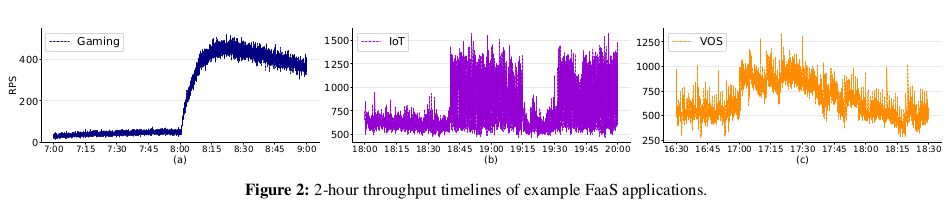

그림 2(a) 는 요청 스파이크가 22에서 485 RPS 까지 22배의 peak-to-trough 비율로

치솟는 것을 보여준다.

IoT 와 VOS 는 bursty 할 뿐만 아니라 패턴이 다르다.

그림 2(b) 에서 볼 수 있듯이 IoT 는 약 682 RPS 의 지속적인 처리량을 나타내지만,

처리량이 갑자기 1460 RPS 이상으로 증가하여 약 40분간 최고 처리량이 지속되고

첫 번째 피크 종류 후 15분 후에 두 번째 피크가 시작된다.

VOS (그림 (c)) 의 경우 처음 30분 동안 최대 처리량이 982 (380) RPS 인

580 RPS 의 평균 처리량을 관찰하는 반면, 평균 처리량은 30분에 920 RPS 로 증가하다가

점차적으로 다시 560 RPS 로 감소한다.

*Implication1: 이러한 동적 동작을 위해서는 요청 burst 중에 FaaS 어플리케이션에서 발생할 수 있는*

*latency 급증을 빠르게  완화하기 위해 많은 수의 확장 가능하고 탄력적인*

*function 컨테이너 provisioning 이 필요하다.*

**2.2.2 Cold Start Costs of Containerized Functions** 

---

다음으로 컨테이너형 Functions 의 cold start 비용에 초점을 맞춘다.

우리의 맥락에서 cold start 는 사용자 정의 컨테이너 기반 Functions 의 최초 호출을 의미한다.

Functions 을 실행하기 전에 FaaS provider 가 이미지 데이터를 가져와서

컨테이너 런타임을 시작해야 하기 때문에

cold start 지연 시간은 일반적으로 몇 초에서 몇 분까지로 길다.

이전 연구들에서 언급된 바와 같이,

> 논문 링크의 이전 연구들 Abstract 읽어보기 !
> 

높은 cold start 패널티는 탄성을 해치기 때문에 FaaS provider 에게 악명 높은 장애물이다.

cold start 문제는 의존성이 큰 사용자 지정 컨테이너 Functions 이 지원되는 경우 악화된다.

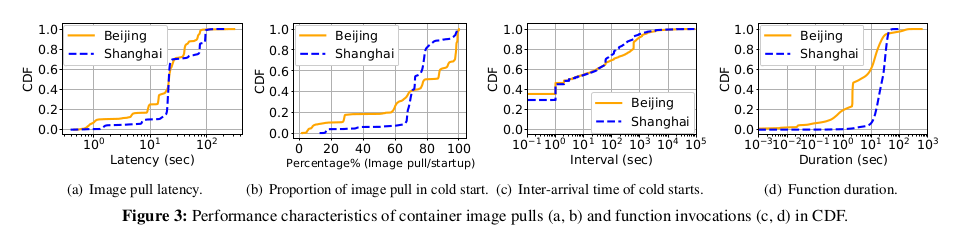

우리는 Function Compute 에서 관리하는 베이징과 상하이 두 지역의

컨테이너 다운로드 비용을 분석했다.

Function 컨테이너 레지스트리의 통계를 기록하고 컨테이너화된 함수에 대한

712,295 개의 cold start 작업 성능 특성을 기록한 15일 로그를 검색했다.

그림 3(a) 와 같이 베이징의 경우 이미지 pull 중 약 57% 의 대기 시간이 45초 이상인 반면

상하이의 경우 이미지 pull 중 86% 이상이 최소 80초 이상 소요된다.

다음으로 총 Function cold start 지연 시간과 관련하여 이미지 pull 에 소요된 시간의 비율을 조사했다.

그림 3(b) 는 베이징과 상하이의 경우 Function 호출 요청의 50% 이상이

컨테이너 이미지 pull 에 전체 Function 시작 시간의 최소 80%, 72% 를 소비한다는 것을 보여준다.

이는 이미지 pull 비용이 대부분 Function 의 cold start 비용을 차지한다는 것을 나타낸다.

cold start 비용을 고려하여 cold start inter-arrival time 과 function duration 을 추가로 조사했다.

그림 3(c) 는 연속 cold start 요청의 간격 분포를 나타낸다.

두 지역 모두 function cold start 중 약 49% 가 도착 간 시간이 1초 미만인 것으로 나타나

cold start 요청 빈도가 높다는 것을 의미한다.

그림 3(d) 와 같이 베이징 지역의 function 실행의 약 80% 는 1초보다 길다.

상하이 지역의 경우 function duration 의 약 80% 가 32.5초 미만이며

90번째 백분위수는 36.6초, 99번째 백분위수는 45.6초 이다.

이 분포는 cold start 비용이 function duration 과 같은 규모임을 나타내며

컨테이너 startup 의 최적화 필요성을 강조했다.

*implication2: 컨테이너 provisioning 성능을 최적화하면 컨테이너 기반 클라우드 function 의*

*cold start 비용을 절감하는 데 큰 이점을 얻을 수 있다.*

## 3. FaaSNet Design 

---

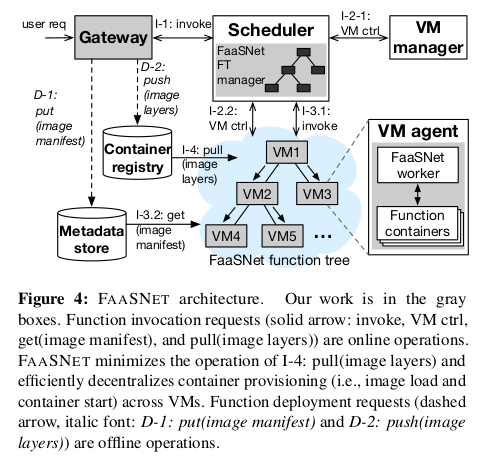

### 3.1 Design OverView 

---

본 섹션은 FaaSNet 의 구조에 대한 높은 수준의 개요를 제공한다.

그림 4는 FaaSNet 을 실행하는 FaaS 플랫폼의 아키텍처를 보여준다.

FaaSNet 은 VM 전체에 걸쳐 컨테이너 provisioning 3(?) 을 분산하고 병렬화한다.

FaaSNet 은 FT 매니저 컴포넌트와 워커 컴포넌트를 우리의 기존 FaaS 스케줄러 및

VM 에이전트에 통합하여 FT 관리를 조정한다.

다음으로, 우리는 FaaS 플랫폼의 주요 구성 요소에 대해 설명한다.

게이트웨이는 아래 역할을 담당한다.

1. tenent IAM (Identity Access Management) 인증
2. Function 호출 요청을 FaaS 스케줄러에게 전달
3. 일반 컨테이너 이미지를 I/O 효율적인 데이터 형식으로 변환

스케줄러는 function 호출 요청을 처리하는 역할을 한다.

우리는 FaaSNet 관리자를 스케줄러에 통합하여 FT 의 삽입 및 삭제를 통해

FT 트리를 관리한다. (섹션 3로 링크)

FT 는 여러 호스트 VM 을 연결하여 빠르고 확장 가능한 컨테이너 provisioning 네트워크를 형성하는

이진 트리 overlay 이다.

각 VM 은 VM-local function 관리를 담당하는 FaaS VM 에이전트를 실행한다.

컨테이너 provisioning 작업을 위해 FaaSNet worker 를 VM 에이전트에 통합한다.

function 호출 경로에서 스케줄러는 먼저 VM 관리자와 통신하여

사용 가능한 VM pool 에서 활성 VM pool 을 확장하거나

요청된 function 의 인스턴스를 보유하는 모든 VM 이 사용 중일 경우

사용 가능한 VM pool 에서 활성 VM pool 을 확장한다.

그리고 나서 스케줄러는 로컬 FT 메타데이터를 질의하고

컨테이너 provisioning 프로세스 (섹션 3.3로 링크) 를 시작하기 위해

FT 의 FaaSNet worker 에게 RPC 요청을 보낸다.

컨테이너 런타임 provisioning 프로세스는 아직 로컬에서 런타임이 provisioning 되지 않은

FT 의 모든 VM 에서 효과적으로 분산되고 병렬화된다.

FaaSNet worker 가 요청 시 function 컨테이너 레이어를 가져오는 동안

스케줄러는 중요한 경로에 위치하면서,

할당된 peer VM 에서 병렬로 컨테이너 런타임 (섹션 3.5 로 링크) 을 생성한다.

> RPC : 프로세스간 통신을 위해 사용하는 IPC 방법의 한 종류
> 
> 
> 원격지의 프로세스에 접근하여 프로시저 또는 함수를 호출하여 사용
> 

[2.1](https://www.notion.so/translate-bcd064885722419da9a07f7cd918114d) 에서 설명한 것처럼, function 배포 경로에서 게이트웨이는

tenent 를 마주보는 컨테이너 레지스트리에서 일반 이미지를 가져와서

레이어를 블록별로 압축하고,

format 관련 정보를 포함하는 메타데이터 파일 (이미지 매니페스트) 을 생성하며,

변환된 계층 및 관련 매니페스트를 각각

알리바바 클라우드 내부 컨테이너 레지스트리와 메타데이터 저장소에 기록함으로써

function 의 일반 컨테이너 이미지를 I/O 효율적인 형식(3.5 링크) 으로 변환한다.

### 3.2 Function Trees 

---

우리는 FT 를 설계할 때 다음과 같은 design choice 를 한다.

1. function 에는 별도의 FT 가 있다.
    
    즉, FaaSNet 은 function 단위에서 FT 를 관리한다.
    
2. FT 에는 데이터 plain 과 제어 plain 이 분리되어 있다.
    
    즉, FT 의 각 VM worker 는 컨테이너 provisioning (데이터 plain) 및
    
    스케줄러(3.3 으로 링크)에 대한 글로벌 트리 관리 (제어 plain) 의 동등하고 간단한 역할을 갖는다.
    
3. FaaSNet 은 작업 부하에 동적으로 적응할 수 있는 균형 잡힌 이진 트리 구조를 채택한다.

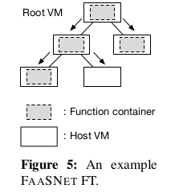

***세분화된 Function 에서 트리 관리***

FaaSNet 은 최소 한 번 이상 호출되고 회수되지 않은 각 function 에 대해

별도의 고유한 트리를 관리한다.

그림 5는 5개의 호스트 VM 에 걸쳐 있는 3단계 FT 의 토폴로지를 보여준다.

function 컨테이너 이미지는 트리의 root VM 아래로 leaf node 에 도달할 때까지 스트리밍된다.

***균형 잡힌 이진 트리***

FaaSNet 의 핵심은 균형 잡힌 이진트리이다.

이진 트리에서 루트 노드와 리프 노드를 제외하고 4개의 각 트리 노드 (호스트 VM의 경우) 에는 

들어오는 edge 하나와 나가는 edge 두 개가 있다.

이 설계는 네트워크 경합을 피하기 위해 VM 당 동시 다운로드 작업 수를 효과적으로 제한할 수 있다.

노드가 N 개인 균형 이진 트리의 높이는 log(N) 이다.

이것은 균형 잡힌 이진 트리가 function 컨테이너의 이미지 및 레이어 데이터를

대부분의 log(N) hop 이 위에서 아래로 이동하는 것을 보증하기 때문에 바람직하다.

> hop : 네트워크에서 두 장치를 연결하는 것, 노드 또는 네트워크 사이 중간 장치
> 

FT 의 높이가 데이터 전파의 효율성에 영향을 미치기 때문에 이것은 매우 중요하다.

또한, 워크로드의 동적성을 수용하기 위해 균형 잡힌 이진 트리의 구조가 동적으로 변경될 수 있다.

이를 위해, FaaSNet 은 균형 잡힌 이진 트리로 각 FT 를 구성한다.

FT 관리자(그림 4)는 FT 를 동적으로 확장하거나 축소하기 위해

insert 와 delete 두 API 를 호출한다.

***insert:*** FT 의 첫 번째 노드가 루트 노드로 삽입된다.

FT 관리자는 BFS (breadth-first search) 를 통해 각 트리 노드에 있는 자식 노드 수를 추적하고

0 또는 1 자식이 있는 모든 노드를 대기열에 저장한다.

새 노드를 삽입하기 위해 FT 관리자는 queue 에서 첫 번째 노드를

새 노드의 부모로 선택한다.

***delete:** 일정 시간 (알리바바 클라우드 구성의 경우 15분) 동안 유휴 상태인 VM 을*

*스케줄러가 회수할 수 있다.*

따라서 FaaSNet 의 수명은 제한되어 있다.

회수로 인한 VM 이탈을 수용하기 위해 FT 관리자는 delete 를 호출하여 회수된 VM 을 삭제한다.

삭제 작업은 필요한 경우 FT의 구조를 재조정한다.

AVL 트리나 레드-블랙 트리와 같은 이진 검색 트리와 달리

FT의 노드에는 비교할 수 있는 키(및 관련 값)가 없다.

따라서 트리 밸런싱 알고리즘은 한 개의 불변성만 유지하면 된다.

즉, 노드의 왼쪽과 오른쪽 하위 트리 사이의 높이 차이가 1보다 큰 경우에만

균형 조정 작업이 트리거된다.

FT는 모든 불균형 상황을 처리하기 위한 네 가지 방법을 구현한다:

left_rotate, right_rotate, left_right_rotate, right_left_rotate.

공간 제한으로 인해 트리 밸런싱 알고리즘의 세부 사항은 생략한다.

그림 6과 그림 7은 각각 right_rotate 연산과 right_left_rotate 연산 과정을 보여줍니다.

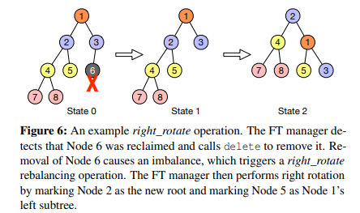

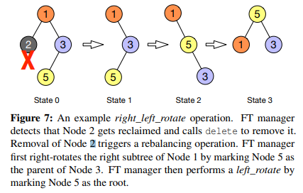

### 3.3 Function Tree Integration 

---

이 섹션에서는 알리바바 클라우드의 FaaS 플랫폼에 FT 체계를 통합하는 방법에 대해 설명한다.

이 통합은 기존 FaaS 플랫폼의 두 구성 요소인 스케줄러와 VM 에이전트를 포괄한다.

구체적으로, 우리는 FaaSNet 의 FT manager 를 알리바바 클라우드의 FaaS 스케줄러에,

FaaSNet 의 VM worker 를 알리바바 클라우드의 FaaS VM 에이전트에 각각 통합한다(그림 4).

스케줄러는 FT 관리자를 통해 FT의 VM을 관리한다.

스케줄러는 각 VM 에이전트에서 FaaSNet worker 를 시작한다.

FaaSNet worker 는

1. 이미지 다운로드 및 컨테이너 provisioning 작업을 수행하기 위한 스케줄러의 명령을 제공하고,
2.  VM의 function 컨테이너를 관리해야 한다.

**FT Metadata Management**

스케줄러는 관련 FT 데이터 구조에 function ID 를 매핑하는,

<functionID, FT> key-value 쌍을 기록하는 메모리 내 매핑 테이블을 유지 관리한다.

FT 데이터 구조는 VM의 주소:포트 같은 정보를 추적하기 위해

함수 및 VM을 나타내는 인메모리 개체 집합을 관리한다.

스케줄러는 분할되어 있으며 가용성이 높다.

각 스케줄러 shard 는 메모리 메타데이터 상태를,

 etcd 를 실행하는 분산 메타데이터 서버와 주기적으로 동기화한다.

> shard : 조각
> 
> 
> etcd: [https://etcd.io/](https://etcd.io/)
> 
> 분산 시스템의 데이터를 위한, 분산되고 신뢰할 수 있는 key-value store
> 

**Function Placement on VMs**

FaaSNet 을 사용하면 효율성을 위해 한 VM이 동일한 사용자에게 속하는

여러 기능을 보유할 수 있다.

function compote 는 VM이 function 을 호스팅하기에 충분한 메모리를 가지고 있는 한

하나의 VM 호스트에서 가능한 한 많은 function 을 할당하는

binpacking 경험적 접근 방식을 사용한다.

따라서 VM은 겹치는 여러 FT의 토폴로지에 관여할 수 있다.

그림 8은 가능한 FT 배치의 예를 보여준다.

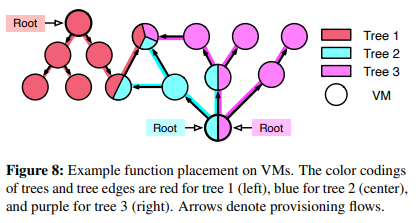

네트워크 병목 현상을 방지하기 위해 FaaSNet 은

VM 에 배치할 수 있는 funtion 수를 제한하고 있고, 이 제한은 20개로 설정했다.

우리는 섹션 5에서 FT 인식 배치의 제안에 대해 논의한다.

> bin packing : n 개의 아이템을 m 개의 bin 에 채워넣는 문제 ?
> 
> 
> m 개의 각 bin 은 최대 용량이 제한되어 있다.
> 
> heuristic : 경험적인
> 

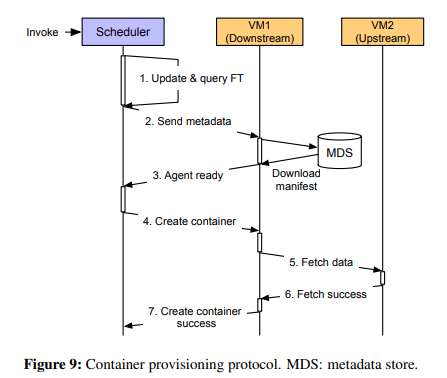

**Container Provisioning Protocol**

스케줄러와 FaaSNet VM worker 간의 RPC 통신을 조정하고

컨테이너 provisioning 을 용이하게 하는 프로토콜을 설계한다(그림 9).

호출 요청 시 스케줄러가 요청을 처리할 수 있는 활성 VM이 부족하거나

현재 VM이 모두 요청을 처리 중임을 감지하면 스케줄러는 사용 가능한 VM 풀에서

하나 이상의 새 VM을 예약한 다음 컨테이너 provisioning 프로세스를 시작한다.

이 경우 일반성의 손실 없이 VM(VM1)이 하나만 예약되었다고 가정한다.

1단계에서 스케줄러는 VM1에 대한 새 메타데이터 개체를 생성하고

요청한 functionID 와 연결된 FT 에 삽입한다.

그런 다음 스케줄러는 FT를 질의하여 upstream peer VM(VM2)의 address:port 를 가져온다.

2단계에서 스케줄러는 VM2의 function 메타데이터와 address:port를 VM1로 보낸다.

정보를 수신하면 VM1은 두 가지 작업을 수행한다.

1. function 컨테이너 이미지의 .tar 매니페스트 파일을 메타데이터 저장소(섹션3.1)에서
    
    다운로드하고
    
2. 매니페스트를 로드 및 검사하며 이미지 계층의 URL을 가져오고
    
    VM1의 로컬 저장소에 URL 정보를 유지한다.
    

3단계에서 VM1은 스케줄러에게,

요청된 function 에 대한 컨테이너 런타임 생성을 시작할 준비가 되었다고 회신한다.

스케줄러는 VM1로부터 응답을 받은 다음

4단계에서 컨테이너 RPC 생성 요청을 VM1로 보낸다.

5단계와 6단계에서 VM1은 2단계에서 처리된 매니페스트 구성을 기반으로

upstream VM2 에서 layer 를 가져온다.

7단계에서 VM1은 컨테이너가 성공적으로 생성되었다는 RPC를 스케줄러에 보낸다.

**FT Fault Tolerance**

스케줄러는 VM 에 주기적으로 ping 을 보내 VM 장애를 신속하게 감지할 수 있다.

VM이 다운되면 스케줄러는 FT 토폴로지를 수정하기 위해 트리 밸런싱 작업을 수행하도록

FT manager 에게 알린다.

> Tolerance : 내성, 저항력
> 

### 3.4 FT Design Discussion 

---

FaaSNet 은 메타데이터를 많이 사용하는 관리 작업을 기존 FaaS 스케줄러로 오프로드하여

FT의 각 개별 노드가 상위 peer 에서 데이터를 가져오는 것과 동일한 역할을 수행하도록 한다

(있는 경우 하위 노드에 데이터를 seed 하는 역할).

FT의 루트 노드는 상위 peer 가 없고 대신 레지스트리에서 데이터를 가져온다.

FaaSNet 의 FT 설계는 FT가 요청된 컨테이너를 저장하는

하나 이상의 활성 VM을 가지고 있는 한 레지스트리에 대한 I/O 트래픽을 완전히 제거할 수 있다.

앞서 워크로드 분석에 따르면 일반적인 FaaS 애플리케이션의 처리량은

항상 0 RPS(섹션 2.2)를 초과한다.

이는 실제로 요청 burst 가 0에서 N으로 확장되는 것보다

1에서 N으로 확장될 가능성이 더 높다는 것을 의미한다.

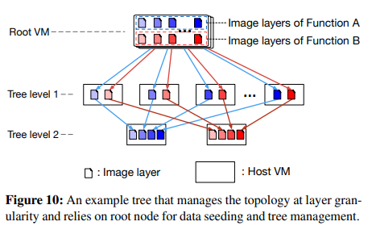

또 다른 설계는 토폴로지를 더 미세한 층(즉, blobs) 세분도로 관리하는 것이다.

이 접근 방식에서 각 개별 계층은 논리 계층 트리를 형성한다.

function 컨테이너 이미지에 속한 layer 는 결국 다른 VM에 상주할 수 있다.

FaaSNet 의 FT는 계층 트리 모델의 특수한 경우이다.

그림 10은 예를 보여준다.

이 예에서는 한 VM이 다른 function 컨테이너 이미지에 속하는 layer 파일을 저장한다.

따라서 많은 downstream VM peer 가 동시에 이 VM에서 layer 를 가져올 때

네트워크 병목 현상이 발생할 수 있다.

겹치는 많은 layer 트리가, 완전히 연결된 전체 네트워크 토폴로지를 형성하기 때문이다.

VM이 고대역폭 네트워크에 연결된 경우 전체 토폴로지가 잘 확장될 수 있다.

그러나 All-to-Alliba Cloud의 경우처럼 각 VM에 리소스가 제약되어 있으면

전체 토폴로지가 네트워크 병목 현상을 쉽게 일으킬 수 있다.

우리는 FaaS 인프라에서 2코어 CPU, 4GB 메모리 및 1Gbps 네트워크를 갖춘 소형 VM을 사용한다.

**On-Demand I/O**

시작할 때 모든 layer 를 한 번에 읽을 필요가 없는 어플리케이션의 경우,

블록 기반 이미지 가져오기 메커니즘은 원격 스토리지(예: 컨테이너 레지스트리 또는 peer VM)에서

layer 데이터를 느리게(on-demand) 블록 레벨에서 가져올 수 있는 옵션을 제공한다.

먼저, FaaSNet VM worker 인 어플리케이션은

메타데이터 저장소에서 이미지 매니페스트 파일을 다운로드하고

이미지를 로컬로 로드하여 .tar 이미지 매니페스트를 로드한다.

둘째, 첫 번째 블록과 마지막 블록(압축된)의 인덱스를 계산한 다음

오프셋 테이블을 참조하여 오프셋 정보를 찾는다.

마지막으로, 압축된 블록을 읽고 읽은 데이터의 양이 요청된 길이에 일치할 때까지 압축을 푼다.

기본(원격) 블록 저장 장치에 대한 읽기가 블록 경계에 맞춰져야 하기 때문에

응용 프로그램이 요청된 것보다 더 많은 데이터를 읽고 압축을 풀어서

읽기 증폭을 일으킬 수 있다.

그러나 실제로 압축 해제 알고리즘은

블록 스토리지나 네트워크보다 훨씬 더 높은 데이터 처리량을 달성한다.

따라서 CPU 오버헤드를 I/O 비용 절감과 교환하는 것이 사용 시나리오에서 유리하다.

우리는 섹션 4.6에서 on-demand I/O의 효과를 평가한다.

**RPC and Data Streaming**

사용자 수준의 zero-copy RPC 라이브러리를 구축한다.

이 접근 방식은 struct iovec 불연속 버퍼를 전송하기 위해

비차단 TCP sendmsg 및 recvmsg를 활용한다.

RPC 라이브러리는 RPC 헤더를 버퍼에 직접 추가하여

사용자 공간에서 효율적인 zero-copy 직렬화를 달성한다.

RPC 라이브러리는 HTTP/2의 멀티플렉싱과 유사하게

요청 파이프라인 및 비순차적 수신을 달성하기 위해 요청에 태그를 지정한다[14].

FaaSNet worker 가 데이터 블록 전체를 수신하면,

worker 는 즉시 블록을 downstream peer 로 전송한다.

## 4. Evaluation 

---

이 섹션에서는 알리바바 클라우드의 FaaS 플랫폼의 생산 추적을 사용하여 FaaSNet 을 평가한다.

또한 microbenchmark 를 통해 FaaSNet 의 확장성과 효율성을 검증한다.

### 4.1 Experimental Methodology 

---

우리는 중간 규모의 500-VM pool 과 대규모 1,000-VM pool 을 사용하여

알리바바 클라우드의 function compute 플랫폼에 FaaSNet 를 배포한다.

프로덕션 FaaS 플랫폼에서 사용하는 것과 동일한 구축 구성을 따른다.

모든 VM은 CPU 2개, 메모리 4GB, 네트워크 1Gbps가 포함된 인스턴스 유형을 사용한다.

FaaSNet 가 VM 인스턴스를 예약하여 클라우드 function 을 시작할 수 있는

free VM pool 을 유지한다.

이렇게 하면 컨테이너 provisioning 지연 시간에

VM 인스턴스를 cold start 하는 시간이 포함되지 않는다.

FaaSNet 는 on-demand fetching 및 streaming 을 위해 512KB의 블록 크기를 사용한다.

달리 명시되지 않은 한, 파이썬 3.8 PyStan 어플리케이션을 약 2초간 실행하는 function 을 사용한다.

function 컨테이너 이미지의 크기는 758MB이고,

function 은 3008MB 메모리로 구성되었으며, 각 VM은 하나의 컨테이너화된 function 을 실행한다.

**System Comparison**

우리의 평가에서, 우리는 FaaSNet 을 다음과 같은 세 가지 구성과 비교한다.

1. Kraken: Uber 의 P2P 기반 레지스트리 시스템.
    
    리소스가 제한된 VM 인프라에 하나의 origin node 가 있는 Kraken devcluster 를 구축한다.
    
2. baseline: Alibaba Cloud Function Compute의 현재 프로덕션 설정.
    
    baseline 은 중앙 컨테이너 레지스트리에서 vanlia 도커 pull 을 사용하여
    
    컨테이너 이미지를 다운로드한다.
    
3. on-demand: baseline 을 기반으로 하지만 컨테이너 레지스트리에서 요청 시
    
    컨테이너 layer 데이터(섹션 3.5)를 가져온다.
    
4. DADI+P2P: 알리바바의 DADI P2P 사용.
    
    이 접근 방식은 리소스가 제한된 VM 하나를 루트 노드로 사용하여 P2P 토폴로지를 관리한다.
    

**Goals**. 우리는 다음 질문에 답하는 것을 목표로 한다:

1. FaaSNet 은 워크로드 성능에 미치는 영향을 최소화하면서
    
    burst FaaS 워크로드 하에서 function 컨테이너를 신속하게 provisioning 할 수 있는가?
    
2. 호출 동시성 level (섹션 4.3) 증가에 따라 FaaSNet 이 확장되는가 ?
3. function 배치가 FaaSNet 의 효율성(섹션 4.4)에 어떤 영향을 주는가 ?
4. FaaSNet 의 I/O 효율적인 데이터 형식은 어떻게 작동하는가 ?
5. FaaSNet 의 on-demand fetching(섹션 4.6) 은 얼마나 효과적인가 ?

### 4.2 FaaS Application Workloads 

---

이 섹션에서는 생산 작업 부하에서 수집된 (확장된) 어플리케이션 추적을 사용하여

FaaSNet 을 평가한다 (자세한 내용은 섹션 2.2 참조).

**Trace Processing and Setup**

우리는 IoT 앱과 게임 앱의 두 가지 FaaS 어플리케이션을 사용하여 FaaSNet 을 평가한다.

원래 게임 워크로드는 처리량이 점진적으로 증가하므로(그림 2(a)),

대신 게임 워크로드를 기반으로 합성 burst 워크로드를 생성하여

스트레스 테스트를 위한 날카로운 버스트 패턴을 시뮬레이션한다.

테스트 클러스터에는 최대 1,000개의 VM이 있으므로 클러스터 크기에 비례하는

두 워크로드 트레이스의 최대 처리량(원래 처리량의 약 1/3)을 축소하고

기간을 2시간에서 1시간 미만으로 단축한다.

**IoT Trace**

IoT 추적은 두 개의 호출 요청 burst 를 나타낸다.

첫 번째 burst 는 9분에 발생하며 처리량은 10 RPS에서 300-400 RPS로 증가한다.

최대 처리량은 약 18분간 지속되었다가 28분에 다시 10 RPS로 돌아간다.

40분에 두 번째 burst 가 일어나 처리량이 100RPS 로 증가하다가

약 2분 후에 약 400RPS로 뛰어오른다.

그림 11(a)는 워크로드의 처리량 및 지연 시간 변화에 대한 55분 타임라인을 보여준다.

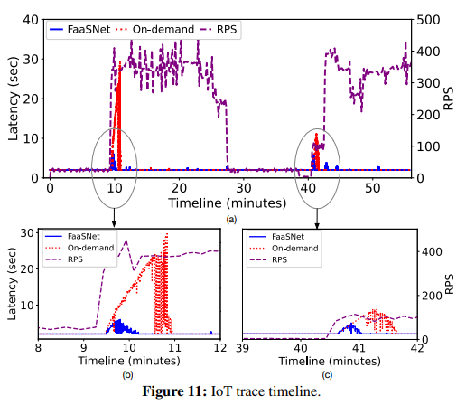

10분 후, 즉각적인 처리량 증가는 FaaS 스케줄러 측에서 function 호출 요청의 백로그를 발생시킨다.

따라서 스케줄러는 사용 가능한 VM pool 에서 많은 수의 사용 가능한 VM을 예약하여

활성 VM pool 을 확장하고 function 컨테이너 provisioning 프로세스를 시작한다.

기본적으로 새로 예약된 모든 VM은 레지스트리에서 컨테이너 이미지를 가져오기 시작하므로

레지스트리 측에서 성능 병목 현상이 발생한다.

그 결과, 어플리케이션 인식 응답 시간

(컨테이너 시작 지연 시간과 약 2초의 function 실행 시간을 포함하는 end-to-end runtime)이

2초에서 약 28초로 증가한다.

게다가, 레지스트리 병목 현상은 불가피하게 응답 시간을

정상으로 되돌리는 데 필요한 시간을 연장시킨다.

그림 11(b)에 표시된 바와 같이 baseline 은 전체 컨테이너 provisioning 프로세스를 완료하고

응답 시간을 거의 113초 만에 정상으로 되돌린다.

대조적으로, FaaSNet 은 레지스트리 병목 현상을 피한다.

즉, 레지스트리에서 컨테이너 이미지를 다운로드하는 대신

새로 예약된 각 VM은 FT의 upstream peer 에서 이미지 데이터를 블록 단위로 가져와

데이터 스트리밍 파이프라인을 형성한다.

VM이 충분한 데이터 블록을 가져오는 한 컨테이너를 시작한다.

FaaSNet 은 최대 응답 시간을 28초에서 6초로 단축한다.

6초 중 약 4초가 upstream peer VM에서 이미지 layer 를 가져오는 데 소요된다

(컨테이너 provisioning 지연 시간은 그림 13 뒷부분에서 설명).

더욱 중요한 것은 FaaSNet 이 서비스를 정상으로 되돌리는 데 28초밖에 걸리지 않는다는 점이다.

이는 on-demand 사례에 비해 4배 향상된 것이다.

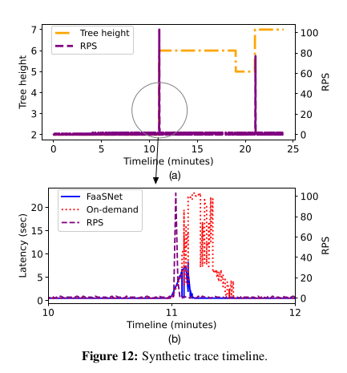

**Synthetic Trace**

합성 추적 테스트에서는 두 가지 함수 호출 요청 burst 를 시뮬레이션하고 FT의 적응성을 평가한다.

그림 12(a)는 FaaSNet 의 높이 변화 타임라인을 보여준다.

11분에 처리량이 1 RPS에서 100 RPS로 갑자기 증가한다. FaaSNet 은 burst 를 감지하고

FT를 높이 2(하나의 루트 VM 및 1개의 peer VM)에서 7(총 82개의 VM) 까지 빠르게 스케일링한다.

FT는 11분에 병렬 컨테이너 provisioning 을 즉시 시작하고 약 10초 안에 지연 시간 급증을 유지한다

(그림 12(b)). 첫 번째 burst 후 처리량은 다시 1RPS로 떨어진다.

일부 VM은 콜드(Cold) 상태가 되고 첫 번째 버스트 이후 약 15분 만에 VM manager 에 의해 회수된다.

두 번째 burst 가 발생하기 전에 VM 수는 점차적으로 30개로 줄어든다.

이에 따라 FT의 높이는 6에서 5로 감소한다 (그림 12(a)).

21분에 두 번째 burst 가 오면 FT manager 는 62개의 VM을 추가하여 FT를 확장하기로 결정한다.

총 102개의 VM으로 두 번째 burst 의 동시 요청을 처리하기 위해 FT의 높이는 최대 7에 이른다.

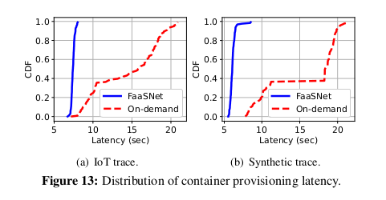

**Container Provisioning Cost**

다음으로 두 워크로드에서 나타나는 컨테이너 provisioning 지연 시간을 분석한다.

그림 13에서 볼 수 있듯이, on-demand 레지스트리는 성능 병목 현상을 일으키기 때문에

on-demand 에서는 약 7초에서 최대 21초까지

매우 다양한 컨테이너 provisioning 지연 시간이 발생한다.

컨테이너의 약 80%가 시작하는데 최소 10초가 걸린다.

컨테이너 시작 지연 시간은 FaaSNet 에서 상당히 적은 변동으로 매우 예측 가능하다.

가상 워크로드의 경우 기능의 약 96%를 시작하는 데 5.8초밖에 걸리지 않는다.

IoT 워크로드의 경우 거의 모든 기능이 6.8~7.9초 사이의 짧은 시간 내에 실행된다.

이것은 FaaSNet 이 예측 가능한 컨테이너 시작 대기 시간을 달성할 수 있음을 보여준다.

### 4.3 Scalability and Efficiency 

---

다음으로, 우리는 microbenchmarking 을 통해 FaaSNet 의 확장성과 효율성을 평가한다.

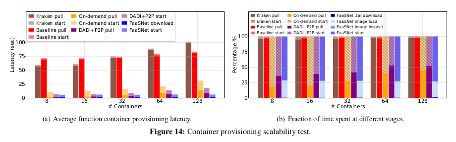

**Scaling Function Container Provisioning**

이 테스트에서는 FaaSNet 이 0에서 N까지 동시 호출 요청을 확장하는 데 걸리는 시간을 측정한다.

여기서 N은 8에서 128까지이다. 각 호출 요청은 VM에 단일 컨테이너를 생성한다.

그림 14에 자세한 결과가 나와 있다.

그림 14(a)에 나타난 바와 같이 크라켄은 8 및 16 동시 요청에서는 Baseline 보다 성능이 약간 우수하지만

32-128 동시 요청에서는 제대로 확장되지 않는다.

이는 Kraken이 VM에서 병목 현상을 일으키는 복잡한 전체 P2P 토폴로지를 사용하여

layer 세분화로 컨테이너를 배포하기 때문이다.

Kraken은 128개의 컨테이너를 실행하는 데 100.4초가 걸린다.

Baseline 은 Kraken보다 약간 더 나은 확장성을 달성한다.

Baseline 이 128개의 function 을 동시에 시작할 때 평균 컨테이너 provisioning 지연 시간은

최대 83.3초에 이른다. 지연에는 두 가지 요인이 있다:

1. 레지스트리가 병목 현상을 일으키며,
2. Baseline 의 도커 pull 은 레지스트리에서 전체 컨테이너 이미지와
    
    layer (758 MB 가치의 데이터)를 끌어와 로컬로 추출해야 한다.
    

On-demand 컨테이너 provisioning 을 Baseline 에 추가하면 대기 시간이 크게 단축된다.

On-Demand 는 컨테이너 시작이 즉시 필요하지 않은 이미지 layer 에 대한 네트워크 I/O를

대부분 제거하기 때문이다.

128개의 function 컨테이너를 provisioning 하는 것은

8개의 컨테이너를 On-demand 시스템에서 provisioning 하는 것보다 2.9배 더 긴 시간이 필요하다.

DADI+P2P를 사용하면 VM이 peer 에서 직접 이미지 layer 를 가져올 수 있으므로

레지스트리에서 대량의 layer 블록을 다운로드할 필요가 없다.

그러나 DADI+P2P에는 여전히 두 가지 병목 현상이 있다.

레지스트리 측에 있는 이미지 pull 은 레지스트리에서 조절되고

layer 별 추출 작업은 로컬 VM에 의해 계단식 방식으로 지연될 수 있다.

다른 병목 현상은 데이터 시딩 외에도 DADI+P2P의 루트 VM에 있다.

layer 트리 토폴로지 설정 및 조정으로 인해 성능 병목 현상이 발생한다.

이는 그림 14(b)에서 64에서 128로 스케일링할 때 DADI+P2P의 이미지 pull 과

컨테이너 시작의 비율이 동일한 수준으로 유지된다는 것을 증명할 수 있다.

그림 14(a)는 FaaSNet 이 높은 동시성 하에서 완벽하게 잘 확장되며 기준보다 13.4배,

크라켄보다 16.3배 빠른 속도를 달성함을 보여준다.

FaaSNet 는 On-demand, DADI+P2P보다 각각 5배, 2.8배 빠르다.

그림 14(b)에서와 같이, FaaSNet 의 평균 컨테이너 provisioning 지연 시간은

이미지 부하와 컨테이너 시작의 두 가지 작업에 의해 지배된다.

FaaSNet 은 이미지 로드 시 두 작업 모두에서 병목 현상을 제거한다.

FaaSNet 은 각 FaaSNet worker 가 메타데이터 저장소에서 이미지 매니페스트를 가져온 다음

로컬에서 이미지 로딩 프로세스를 시작함으로써

각 VM에서 분산 이미지 로딩(기능상 이미지 pull 과 동일)을 가능하게 한다.

병렬로, 컨테이너 시작 시, 각 FaaSNet VM worker 는 peer VM으로부터 layer 블록을 직접 가져오고

충분한 블록을 가져오면 function 컨테이너를 시작한다.

이러한 모든 최적화로, FaaSNet 은 8개에서 128개의 function 스타트업으로 확장할 때

거의 동일한 대기 시간을 유지한다.

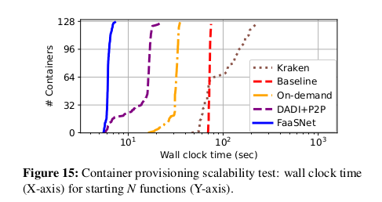

**Function Container Provisioning Pipeline**

다음으로 전체 컨테이너 provisioning 프로세스의 지속 시간을 조사한다.

그림 15는 각 시스템이 N 개의 function 컨테이너를 시작하기 위해 거치는

타임라인 프로세스를 보여준다. 우리는 128-function 동시성 case 만 조사했다.

우리는 FaaSNet 이 5.5초에 첫 번째 function 을 시작하고

7초에 128번째 function을 시작하는 것을 관찰했다.

전체 컨테이너 프로비저닝 프로세스에는 총 1.5초가 소요된다.

On-demand 및 DADI+P2P는 각각 총 16.4초, 19초이다.

구체적으로, 128개의 컨테이너를 모두 시동하는 데 DADI+P2P는 총 22.3초가 소요되며,

이는 FaaSNet 의 14.7배 느리다.

이는 FaaSNet 의 FT 기반 컨테이너 provisioning 파이프라인이

최소 오버헤드를 발생시키고 많은 양의 function 컨테이너를 효율적으로 동시에 불러올 수 있음을 보여준다.

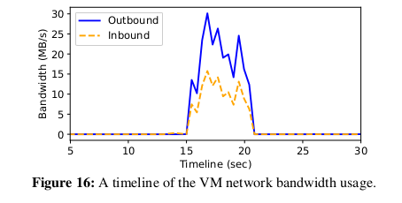

그림 16은 128개 기능 동시성 테스트에서 임의로 선택한 VM의 대역폭 사용 타임라인을 보여준다.

FT 경로의 FaaSNet worker 가

1. upstream VM peer 에서 layer 데이터를 가져오고,
2. downstream 경로에 있는 두 개의 하위 VM peer 에 layer 데이터를 시드하는

두 가지 작업을 수행한다는 점을 기억하자.

컨테이너 provisioning 중에 inbound 연결(upstream 에서 layer 가져오기)의 대역폭 사용량이

두 outbound 연결(layer 를 downstream 으로 보내기)의 약 절반인 것으로 나타났다.

총 최대 네트워크 대역폭은 45MB/s로, VM의 최대 네트워크 대역폭의 35.2%입니다.

또한 outbound 네트워크 전송이 inbound 네트워크 전송과 거의 완벽하게 일치하여

FaaSNet 의 블록 수준 데이터 스트리밍 체계의 유효성을 다시 입증한다.

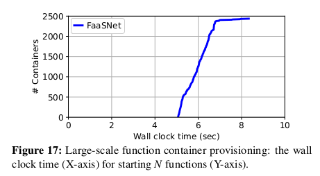

**Large-Scale Function Startup**

이 테스트에서는 VM 1,000개를 만들고 VM에서 2,500개의 function 를 동시에 호출한다.

각 function 은 428MB의 컨테이너를 사용하며 1024MB의 메모리로 실행되도록 구성되어 있다.

각 VM은 이 테스트에서 두 개 또는 세 개의 function 을 실행한다.

그림 17은 모든 기능 컨테이너가 provisioning 을 완료하고

5.1초에서 8.3초 사이에 실행되기 시작하는 것을 보여주며,

이는 다시 FaaSNet 의 뛰어난 확장성을 보여준다.

시간 초과 오류로 인해 테스트를 완료한 On-demand 및 DADI+P2P가 없다.

### 4.4 Impact of Function Placement 

---

function 배치가 컨테이너 provisioning 에 미치는 영향을 정량화하기 위해 민감도 분석을 실시한다.

이 테스트에서는 N개의 VM에서 8개의 function 을 동시에 호출한다.

여기서 N은 4개에서 1개까지 다양하다.

각 기능은 서로 다른 컨테이너(75.4MB)를 가지며 128MB의 function 메모리를 사용하도록

구성되어 있다(VM에는 4GB 메모리가 있으므로 128MB의 20개 function 까지 호스팅할 수 있음).

우리는 FaaSNet 과 DADI+P2P 사이의 컨테이너 provisioning 지연 시간을 비교한다.

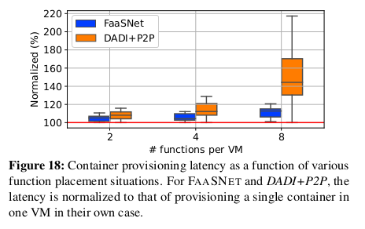

그림 18에서 볼 수 있듯이, DADI+P2P는 4개의 function 과 8개의 function 이 동일한 VM에 배치될 때

대기 시간 변동이 훨씬 커진다.

왜냐하면 DADI+P2P의 루트 VM은 많은 작은 layer 트리의 구축 프로세스로 인해

오버로드되기 때문이다.

### 4.5 I/O Efficient Data Format 

---

다음으로 효율적인 I/O format 이 코드 패키지 provisioning 에 어떻게 도움이 되는지 평가한다.

우리는 1초 동안 sleep 하는 파이썬으로 작성된 간단한 HelloWorld function (헬로월드),

FFmpeg 비디오 인코딩 function (비디오), Tensorflow Serving function 등 세 가지 function 을 선택한다.

FaaSNet 의 입출력 효율 format 을 기본 .zip 형식과 비교한다.

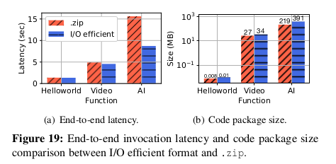

그림 19(a) 는 코드 패키지 다운로드의 지연 시간과 function 지속 시간을 포함한

end-to-end function 호출 성능을 나타낸다.

Hellowold 의 코드 패키지는 크기가 11KB에 불과하므로 I/O 효율적인 format 은 Hellowold의 경우

.zip과 동일한 성능을 발휘한다 (그림 19(b)).

I/O 효율적인 format 은 .zip처럼 모든 데이터를 추출하는 대신 요청 시 데이터를 가져오기 때문에

비디오 및 AI의 경우 .zip에 비해 성능이 우수하다.

그림 19(b)는 코드 패키지 크기를 보여준다.

I/O 효율적인 format 을 사용하면 압축 시 추가적인 스토리지 오버헤드가 발생하기 때문에

funtion 은 I/O 효율적인 format 을 사용할 때 코드 패키지 크기가 커진다.

### 4.6 On-Demand I/O: Sensitivity Analysis 

---

마지막으로 On-demand I/O를 평가하고 블록 크기가 읽기 증폭에 미치는 영향을 비교한다.

On-demand fetching 과 함께, FaaSNet worker 는 function 컨테이너를 시작하기 위해

단지 충분한 layer 데이터 블록만 가져오면 된다.

우리는 세 가지 다른 function 컨테이너 이미지를 선택한다.

(a) 도커 허브에서 Python 3.9 런타임이 있는 195MB 헬로월드 이미지,

(b) AWS 람다 파이썬 3.8 기본 이미지를 기반으로 하는 428MB PyStan 이미지,

(c) 알리바바 클라우드 파이썬 3.8 기본 이미지를 기반으로 하는 728MB PyStan 이미지.

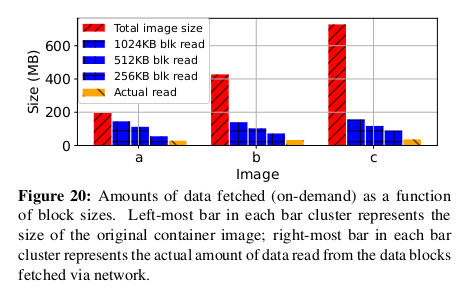

그림 20에서 볼 수 있듯이, On-demand fetching function 은

네트워크를 통해 전송되는 데이터의 양을 줄일 수 있다.

기본 이미지는 의존성이 강하고 이미지 작성 과정에서 일반적으로 사용되기 때문에

이미지 b와 c의 감소는 특히 심오하다.

예를 들어 블록 크기가 512KB(평가에서 사용하는 블록 크기 구성)인 경우

On-demand fetching 은 일반 도커 pull 과 비교하여 네트워크 I/O가 83.9% 감소한다.

우리는 또한 다양한 블록 크기 하에서 다양한 수준의 읽기 증폭을 관찰한다. 이는 시작과 끝 오프셋 위치가

기본 블록 장치에서 (압축된)블록의 경계와 잘못 정렬될 가능성이 높기 때문에

블록 크기가 클수록 FaaSNet worker 가 시작 및 끝 블록에서 더 많은 데이터를 읽을 수 있기 때문이다.

압축 해제 후 (컨테이너를 시작하기 위해) 읽은 실제 데이터 양은 훨씬 작으며,

이는 원래 컨테이너 이미지에 포함된 대부분의 종속성이

컨테이너 시작 단계에서 사용되지 않음을 나타낸다.

읽기 증폭을 줄이기 위한 최적화 탐구는 향후 연구의 일부이다.

## 5. Discussion 

---

이 절에서는 FaaSNet 의 한계와 가능한 향후 방향에 대해 논의한다.

**FT-aware Placement**

function 의 수가 증가하면 네트워크 대역폭의 경합이 뒤따른다.

섹션 4.4가 이전 작업보다 FaaSNet 에서 우려사항이 적다는 것을 입증하지만,

생산의 안전을 위해 클러스터 자원이 허용하는 경우 여러 function 을 함께 배치하지 않도록

시스템을 프로그래밍한다. 향후 맞춤형 컨테이너의 수요 증가를 예상하여

컨테이너 배치 논리를 확장하여 문제를 해결할 계획이다.

일반적인 목표는 여러 function 이 provisioning 될 때

각 VM의 인바운드 및 아웃바운드 통신의 균형을 맞추는 것이다.

직관적으로 컨테이너 배치를 조정하여 VM이 관여하는 FT 수와

VM이 서비스하는 역할(예: leaf vs interior node)을 제어하고 대역폭 소비를 제어할 수 있다.

또 다른 최적화는 공통 layer 를 공유하는 function 을 함께 배치하여 데이터 전송량을 줄이는 것이다.

**Multi-Tenancy**

앞서 언급한 바와 같이 알리바바 클라우드는 컨테이너와 VM을 사용하여

강력한 tenent-level 의 function 분리를 달성하므로

당사의 FaaS 플랫폼은 tenent 간에 VM을 공유할 수 없다.

이것은 FaaSNet 의 FT들이 다른 tenent 들 사이에서 자연스럽게 격리된다는 것을 의미한다.

FaaSNet 을 다른 안전하고 가벼운 가상화 기술로 이식하는 것이 우리의 지속적인 작업이다.

**FaaSNet for Data Sharing**

기술적으로 P2P 통신을 통해 VM 간에 컨테이너 이미지를 공유할 수 있다.

Kubernetes 와 같은 일반 컨테이너 오케스트레이션 시스템을 위한

데이터 공유라는 더 넓은 범위로 일반화할 가능성이 있다.

매트릭스 연산, 데이터 분석, 비디오 처리, 머신러닝 등과 같은

데이터 집약적 어플리케이션이 등장함에 따라 FaaS 플랫폼에서 이러한 필요성이 대두되고 있다.

이들 중 대부분은 데이터 교환을 위해 중앙 집중식 스토리지에 의존하는데,

이는 우리 작업의 컨테이너 레지스트리와 유사한 병목 현상이다.

따라서 우리는 FaaSNet 의 설계가 데이터 공유를 가속화할 수 있다고 믿는다.

단, 두 가지의 추가 과제가 있다.

1. 사용자를 위한 기본 인터페이스를 설계하는 방법
2. 보다 빈번한 토폴로지 구축 및 변경을 위해 트리 관리 알고리즘을 조정하는 방

위 연구는 앞으로의 과제로 남겨둔다.

**Adversarial Workloads**

1초 미만의 지속 시간과 희박한 호출이 있는, 매우 수명이 짧은 function 은

FaaSNet 및 사용자 정의 컨테이너 기반 FaaS 플랫폼에 적대적일 수 있다.

function 환경 캐싱 및 사전 provisioning 은 이러한 워크로드를 처리하는 데 사용할 수 있지만

추가 infrastructure-level 비용이 있다.

**Portability**

FaaSNet 은 상위 수준 FaaS 어플리케이션과 기본 FaaS 인프라 모두에 명확하다.

Function Compute의 기존 VM 회수 정책을 재사용하며,

추가 시스템 레벨 비용을 들이지 않고도 다른 FaaS 플랫폼에 적용할 수 있다.

FaaSNet 을 알리바바 클라우드의 bare-metal 인프라로 포팅하는 것이 우리의 지속적인 작업이다.

> bare-metal : 하드웨어 상에 어떤 S/W 도 설치되어 있지 않은 상태
> 
> 
> 즉, 하드웨어에 직접 설치되는 컴퓨터 시스템이나 네트워크
> 

## 6. Related Work 

---

**Function Environment Caching and Pre-provisioning**

FaaS 응용 프로그램들은 function 호출 요청이 function 시작을 기다려야 할 때

소위 cold start 패널티라고 불리는 긴 대기 시간의 악명높은 지속적인 문제에 직면한다.

상당한 선행 연구는 FaaS 플랫폼의 cold start 지연 시간을 완화하는 방법을 검토했다.

AWS 람다 및 구글 클라우드 function 과 같은 FaaS 제공자들은 cold start 수를 줄이기 위해

일정 시간 동안 호출된 function 을 일시 중지하고 캐시한다.

그러나 이는 제공업체의 TCO를 증가시킬 것이다.

그러한 비용을 줄이기 위해, 연구자들은 들어오는 반복 요청이 warm 컨테이너에 부딪힐 수 있도록

제때 예열 기능을 하는 예측 방법을 제안한다. SAND는 워크플로우 function 의 일부 또는 전체에 대한

컨테이너 런타임을 공유하여 데이터 인접성을 개선하고 function 시작 비용을 절감한다.

SOCK는 Python 컨테이너를 미리 가져온 패키지로 캐시하고 캐시된 컨테이너를 복제하여

function 시작 지연 시간을 최소화한다.

PCPM은 네트워킹 자원을 미리 제공하고 기능 컨테이너에 동적으로 결합하여 기능 시작 비용을 절감한다.

사전 provisioning 된 가상화 환경을 사용하여 function 요청을 신속하게 처리할 수 있지만

이러한 솔루션으로는 function 환경 provisioning 중에 발생하는

높은 비용 문제를 근본적으로 해결할 수 없다.

**Sandbox, OS, and Language-level Support**

일련의 연구는 FaaS cold start 페널티를 완화하기 위한 낮은 수준의 최적화를 제안한다.

Catalyzer 및 SEUS 는 체크포인트 또는 스냅샷에서 생성된 샌드박스 이미지에서

function 인스턴스를 부팅하여 function 초기화 오버헤드를 줄인다.

Faasm 과 같은 시스템은 경량 언어 기반 격리를 활용하여 신속한 function 시작을 달성한다.

FaaSNet 과 달리, 이 솔루션들은 수정된 OS를 요구하거나

프로그래밍 언어 측면에서 호환성과 사용성이 제한적이다.

**Container Storage**

연구자들은 컨테이너 이미지 저장과 검색을 최적화하는 것을 연구해 왔다.

느린 복제와 느린 전파를 이용하여 컨테이너 시작 시간을 단축한다.

이미지는 공유 네트워크 파일 시스템(NFS)에서 저장 및 가져오고 컨테이너 레지스트리에서 참조된다.

Wharf 및 CFS 는 컨테이너 이미지 layer 를 분산 파일 시스템에 저장한다.

Bolt는 성능 향상을 위한 레지스트리 레벨 Caching 을 제공한다.

이러한 작업은 FaaSNet 이 백엔드 컨테이너 저장소로 사용할 수 있다는 점에서 직교적이다.

Kraken 과 DADI 는 컨테이너 layer 분포를 가속화하기 위해 P2P를 사용한다.

이러한 시스템은 정적 P2P 토폴로지를 가정하고 이미지 스토리지, layer seed 또는

메타데이터 관리를 위한 전용 구성 요소가 필요하므로

높은 동적(네트워크 토폴로지의 높은 적응성이 요구됨)과

예측 불가능한 burst(확장성이 높은 컨테이너 배포 필요)에 취약하다.

**AWS Lambda Containers**

AWS는 2020년 12월 1일 AWS 람다에 대한 컨테이너 이미지 지원을 시작했다.

제한된 정보는 다음 자료를 통해 밝혀졌다.

이 function 에 대한 2020년 발표:

AWS는 다중 layer 캐싱을 사용하여 이미지 블록을 공격적으로 캐싱한다.

1. 마이크로VM 로컬 캐시
2. 공유 베어메탈 서버 캐시
3. 공유 가용성 영역 캐시

이 솔루션은 많은 마이크로 VM을 동시에 배치할 수 있는

강력한 베어메탈 서버 기반 클러스터에서는 작동하지만

Alibaba Cloud의 퍼블릭 클라우드 플랫폼에서 관리하는

수천 개의 소규모 VM을 기반으로 하는 FaaS 플랫폼에는 적합하지 않다.

**P2P Content Distribution**

VMThunder는 VM 이미지 배포를 가속화하기 위해 tree-structured P2P overlay 를 사용한다.

유사한 목표를 달성하기 위해 비트토렌트 유사 P2P 프로토콜이 제안된다.

Bullet 은 고대역폭 교차 인터넷간 파일 배포를 위해 overlay mesh 를 사용한다.

FaaSNet 은 이러한 작업을 기반으로 하지만 FaaS 작업량에 맞춘 새로운 설계와 다르다.

## 7. Conclusion 

---

확장 가능하고 빠른 컨테이너 provisioning 을 통해 맞춤형 컨테이너 기반 클라우드 function 을 지원하는

FaaS 제공업체의 근본적인 탄력성을 지원할 수 있다.

FaaSNet 은 FaaS에 최적화된 컨테이너 런타임 provisioning 을 위한

end-to-end 통합 솔루션을 제공하는 최초의 시스템이다.

FaaSNet 은 경량, 분산형, 적응형 function 트리를 사용하여 주요 플랫폼 병목 현상을 방지한다.

FaaSNet 은 대형 클라우드 제공자의 FaaS 플랫폼(알리바바 클라우드 기능 컴퓨팅)의

요구사항에 맞춘 구체적인 솔루션을 제공한다.

우리는 실험 평가를 통해 FaaSNet 이 수천 개의 대형 function 컨테이너를

몇 초 만에 시작할 수 있음을 보여준다.

우리의 희망은 이 작업이 컨테이너 기반 FaaS 플랫폼을 진정으로 탄력적으로 만들고

머신러닝과 빅 데이터 분석을 포함한 의존성이 높은

더 넓은 등급의 FaaS 어플리케이션에 대한 문을 여는 것이다.

향후 연구 및 엔지니어링 노력을 촉진하기 위해,

우리는 FaaSNet 의 FT 프로토타입의 소스 코드와 알리바바 클라우드 function compute 에서 수집된

프로덕션 FaaS cold start 추적을 포함하는 익명 데이터 세트를 공개한다.

[https://github.com/mason-leap-lab/FaaSNet](https://github.com/mason-leap-lab/FaaSNet)